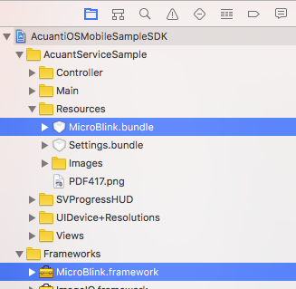
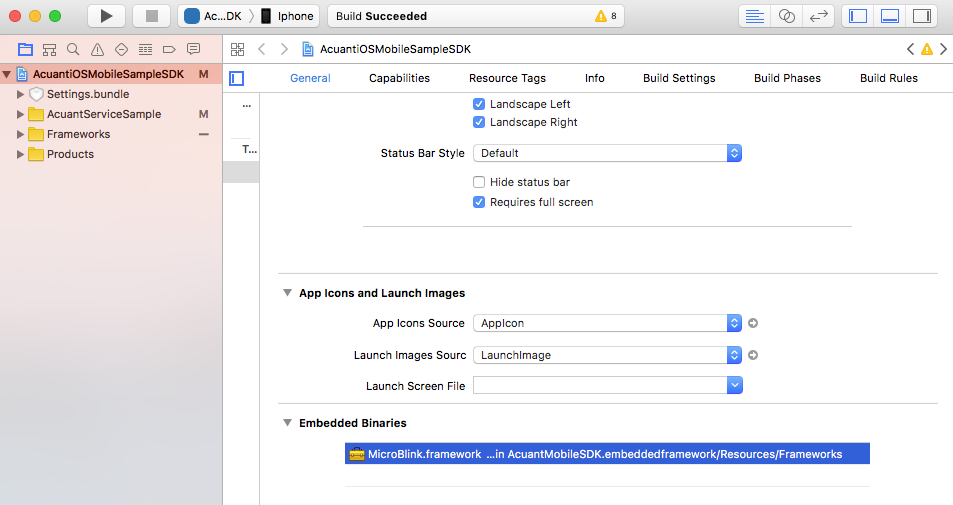
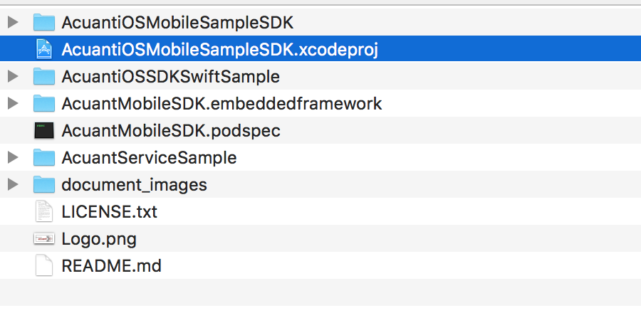
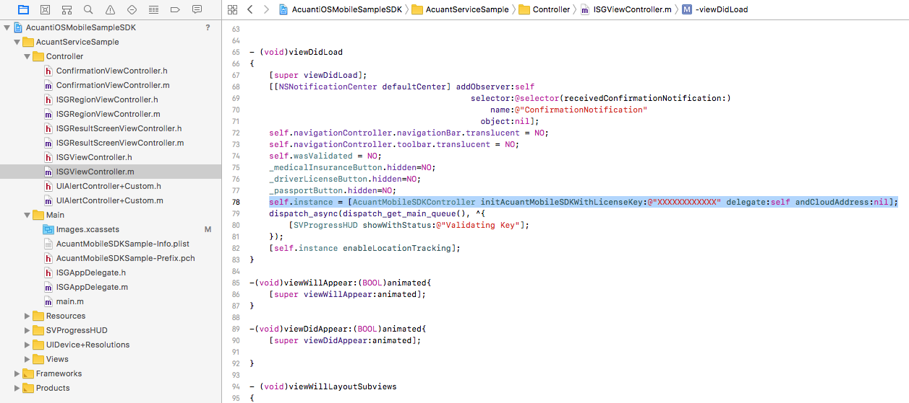
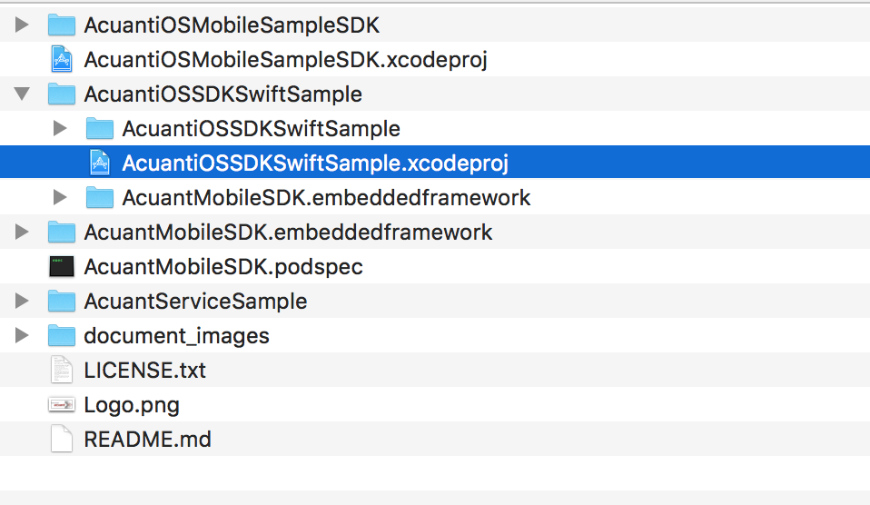
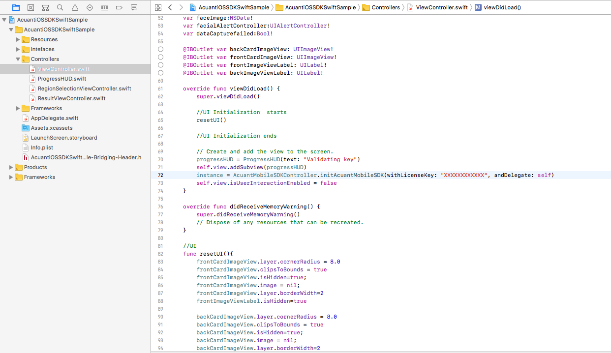

Acuant iOS Mobile SDK API
==================

Last updated on – 08/04/2017

# Introduction

The AcuantMobileSDK.framework is a Cocoa Framework.  Processing of the captured images takes place via Acuant’s Web Services.  Acuant’s Web Services offer fast data extraction and authentication with zero downtime. 

Benefits:

* 	Process Enhancement: Faster data extraction and authentication process images via Acuant’s Web Services.
* 	Easy to set up and deploy.
* 	No maintenance and support: All maintenance and updates are done on Acuant servers.
* 	Secured Connection: Secured via SSL and HTTPS AES 256-bit encryption.

Acuant Web Services supports data extraction from of drivers licenses, state IDs, other govt issued IDs, custom IDs, driver’s license barcodes, passports, medical insurance cards etc. It also supports document authentication and facial recognition to verify and authenticate the identity. 

For IDs from Asia, Australia, Europe, South America, Africa – we return dd-mm-yyyy date format.

For IDs from Canada, USA – we return mm-dd-yyyy date format.

For a complete list of regions, states, and countries supported for ID processing, please see Appendix F of ScanW document - <http://www.id-reader.com/ftp/applications/sdk/docs/ScanW.pdf>

To execute any Acuant iOS Mobile SDK method, a valid license key is required. Please contact <sales@acuantcorp.com> to obtain a license key.

This Acuant iOS Mobile SDK API documentation document has the detailed description of all the important functions a developer would need to write integration with Acuant iOS Mobile SDK.

Note: The Framework will not modify the Status bar of the app.

# Requirements

-   iOS 8.0 or later is required.

-   iPhone 4S and above.

-   iPad 3 and above.

-   iPad mini.

-   iPod Touch 5G and above.

-   The card image must be taken in an acceptable light conditions to avoid glare and overhead lights for example.

-   The card must preferably be fitted with in the brackets on the camera screen, to allow the picture to be taken at a maximum resolution.

# Integration

## Installation with CocoaPods

Acuant iOS Mobile SDK can be installed using CocoaPods. CocoaPods is a dependency manager for Objective-C, which automates and simplifies the process of using 3rd-party libraries like AcuantMobileSDK in your projects.

Note : GitHub has recently changed the versioning for large files. To be able to download large files while cloning from GitHub or CocoaPods repositories please make sure git-lfs is installed in the build machine. More information for git-lfs is available at https://git-lfs.github.com/. Please clone/update our SDK repository only after the git-lfs is installed.

After cloning the repository execute the following command to make sure all files are pulled.

	git lfs pull
	
## Common Error

If git-lfs is not setup , then GitHub doesn't download of large files. Therefore, if the following build error appears while building the iOS app, that means some of the files are missing. 

	ld: warning: ignoring file ../com.acuant.plugin.AcuantMobileSDK/AcuantMobileSDK.framework/AcuantMobileSDK, file was built for unsupported file format ( 0x76 0x65 0x72 0x73 0x69 0x6F 0x6E 0x20 0x68 0x74 0x74 0x70 0x73 0x3A 0x2F 0x2F ) which is not the architecture being linked (armv7): ../com.acuant.plugin.AcuantMobileSDK/AcuantMobileSDK.framework/AcuantMobileSDK
	Undefined symbols for architecture armv7:

	"_OBJC_CLASS_$_AcuantCardProcessRequestOptions", referenced from:

		objc-class-ref in AcuantMobileSDK.o

	"_OBJC_CLASS_$_AcuantMobileSDKController", referenced from:

		objc-class-ref in AcuantMobileSDK.o
	ld: symbol(s) not found for architecture armv7
	clang: error: linker command failed with exit code 1 (use -v to see invocation)

### Podfile

- Create a Podfile with following lines

		platform :ios, '8.0'

		pod 'AcuantMobileSDK', '~> <version number>' 
		(example pod 'AcuantMobileSDK', '~> 5.2')

- Execute 'Pod install' to add the AcuantMobileSDK
- If it is a Swift project then add the follwoing imports in the Objective-C bridging file
- *Apple Reference:* <https://developer.apple.com/library/ios/documentation/Swift/Conceptual/BuildingCocoaApps/MixandMatch.html>

		@protocol AcuantFacialCaptureDelegate;
		@class AcuantMobileSDKController;
 
 		#import <Foundation/Foundation.h>
		#import <UIKit/UIKit.h>
		#import "AcuantMobileSDK/AcuantCardProcessRequestOptions.h"
		#import "AcuantMobileSDK/AcuantCardRegion.h"
		#import "AcuantMobileSDK/AcuantCardResult.h"
		#import "AcuantMobileSDK/AcuantCardType.h"
		#import "AcuantMobileSDK/AcuantDeviceLocationTestResult.h"
		#import "AcuantMobileSDK/AcuantDriversLicenseCard.h"
		#import "AcuantMobileSDK/AcuantError.h"
		#import "AcuantMobileSDK/AcuantFacialCaptureDelegate.h"
		#import "AcuantMobileSDK/AcuantFacialData.h"
		#import "AcuantMobileSDK/AcuantFacialRecognitionViewController.h"
		#import "AcuantMobileSDK/AcuantMedicalInsuranceCard.h"
		#import "AcuantMobileSDK/AcuantMobileSDKController.h"
		#import "AcuantMobileSDK/AcuantPassaportCard.h"

##  Add AcuantMobileSDK.embeddedframework on each project 

If you are not using CocoaPods for Acuant iOS Mobile SDK installation, then you would have to add the AcuantMobileSDK.embeddedframework into your project. You can download the Acuant iOS Mobile SDK and embeddedframework from GitHub - <https://github.com/Acuant/AcuantiOSMobileSDK>.

In order to add the framework to your project, drag the AcuantMobileSDK.embeddedframework folder into your project's file structure.

###  Natives frameworks and libraries

Go to the target.

Click on “Build Phases”.

Expand “Link binary with libraries”.

Click on plus to add frameworks and libraries.

Add following frameworks.

- AssetsLibrary.framework

- SystemConfiguration.framework. 

- AudioToolbox.framework

- AVFoundation.framework.

- CoreMedia.framework.

- CoreVideo.framework.

- CoreGraphics.framework

- QuartzCore.framework.

- CoreMotion.framework

- Accelerate.framework

- CoreText.framework

- CoreLocation.framework

- ImageIO.framework

Add following libraries

- libc++.tdb.

- libiconv.tdb.

- libz.tdb.

**Note: For lower version of Xcode to 7.0 should use .dylib**

- libc++.dylib.

- libiconv.dylib.

- libz.dylib.

Add the following files to the project.The files can be found at AcuantMobileSDK.embeddedframework/AcuantMobileSDK.framework/Versions/5.2/Resources

- Microblink.bundle
- Microblink.framework

Select MicroBlink.framework as the embedded Binaries

### Targets 

Go to the target.

Click on “Build Settings”.

#### Change following targets

	Set “C Language Dialect” with GNU99
	Set “C++ Language Dialect” with Compiler Default
	Set “C++ Standard Library” with Compiler Default

#### Change following flags

	Add on “GCC_PREPROCESSOR_DEFINITIONS” = CVLIB_IMG_NOCODEC

## Integration with Objective-C.
Add the import header in your appDelegate’s header file.

	#import <AcuantMobileSDK/AcuantMobileSDKController.h>	

## Integration with Swift

In order to integrate our SDK on a Swift project you just need to create an Objective-C bridging header to expose those files to Swift. 

Create this bridge is very simple, after you add an Objective-C file, the Xcode propts an alert suggesting to create the header file.

*Apple Reference:* <https://developer.apple.com/library/ios/documentation/Swift/Conceptual/BuildingCocoaApps/MixandMatch.html>

# Objective-C Sample App

The Objective-C Sample app is present at the following location :

To run the Sample app a license key is required.Please contact Acuant to obtain a license key.

# Swift Sample App

The Swift Sample app is present at the following location :

To run the Sample app a license key is required.Please contact Acuant to obtain a license key.

# Activate the license key.

In order to activate the license key, use the following method:

	-((IBAction)activateAction:(id)sender {
		[_instance activateLicenseKey:_licenseKeyText.text];
	}

**Note:** The license key only needs to be activated once. Execute this method only one time. Some licensees are issued by Acuant pre-activated and don’t need further actions.

# Initialize and create the SDK’s instance

## With license key
In the below call, license key is validated and instance is created. 

	//Obtain the main controller instance
	_instance = [AcuantMobileSDKController initAcuantMobileSDKWithLicenseKey:@"MyLicensekey"
	andDelegate:self];

**Note:** This method verifies if the license key is valid and it returns an instance that can be used to reference the methods. We recommend that you create one instance per session in order to optimize your resources.

## With license key and cloud address.

In the below call, license key is validated, the instance is created with the specified cloud address if you are hosting Acuant web services in your own data center. By default, iOS MobileSDK communicates with the Acuant data center. 

	//Obtain the main controller instance
	_instance = [AcuantMobileSDKController
	initAcuantMobileSDKWithLicenseKey:@"MyLicensekey" delegate:self
	andCloudAddress:@"cloud.myAddress.com"];

The cloud Address must not contain “https://”
Ex: “https://cloud.myAddress.com/” must be written “cloud.myAddress.com”

**Note:** This method verifies if the license key is valid and it returns an instance that can be used to reference the methods. We recommend that you create one instance per session in order to optimize your resources.

## If your instance was created previously

	//Obtain the main controller instance
	_instance = [AcuantMobileSDKController initAcuantMobileSDK];

##  Check if the license key validation was successful or not

In order to know if the license key validation has finished or to know if it was successful, use the method below. This method is called after the instance of the MobileSDK has been created.

	-(void)mobileSDKWasValidated:(BOOL)wasValidated{
		_wasValidated = wasValidated;
	}

# Capturing a card

## SDK Configuration for card capture interface.

In order to show the camera interface choose between manual capture interface or barcode capture interface depending on the card type.(AcuantCardTypeMedicalInsuranceCard, AcuantCardTypeDriversLicenseCard, AcuantCardTypePassportCard).

For AcuantCardTypeMedicalInsuranceCard you can only use the manual capture interface.

For AcuantCardTypeDriversLicenseCard, depending on the region, you can only use the manual capture interface and the barcode capture interface.

For IDs from USA and Canada, use manual capture interface for the front side and use barcode capture or manual capture interface for backside.

For IDs from South America, Europe, Asia, Australia, Africa region use manual capture interface for both front and backside.

For AcuantCardTypePassportCard you can choose only manual capture interface.

### In the header file where you'll be doing the parsing, add the following import.

	#import <AcuantMobileSDK/AcuantMobileSDKController.h>

### In the same header file, implement the AcuantMobileSDKControllerCapturingDelegate.

	@interface ISGViewController ()<AcuantMobileSDKControllerCapturingDelegate,
	AcuantMobileSDKControllerProcessingDelegate>

## Card capture interface methods.

### Card capture interface with SDK initializations

In order to initialize the SDK and show the camera interface in the same step you must use the following method:

	[AcuantMobileSDKController initAcuantMobileSDKWithLicenseKey:licenseKey
	AndShowCardCaptureInterfaceInViewController:self delegate:self
	typeCard:_cardType region:_region isBarcodeSide:_isBarcodeSide];

Note: if you are going to use any customization method, then you should create a previous instance of the SDK in order to set the camera customization.

Ex:

	_instance = [AcuantMobileSDKController initAcuantMobileSDK];
	[_instance setWidth:1250];
	
	[AcuantMobileSDKController initAcuantMobileSDKWithLicenseKey:licenseKey 
	AndShowCardCaptureInterfaceInViewController:self 
	delegate:self
	typeCard:_cardType region:_region isBarcodeSide:_isBarcodeSide];

### Manual Card capture interface without initialization
In order to call this function, you will need to initialize the SDK first and create an instance of the SDK to call the function (see point 4)

	[_instance showManualCameraInterfaceInViewController:self delegate:self 
	cardType:_cardType region:_region andBackSide:YES];

### Barcode capture interface without initialization
In order to call this function, you will need to initialize the SDK first and create an instance of the SDK to call the function (see point 4)

	[_instance showBarcodeCameraInterfaceInViewController:self delegate:self 
	cardType:_cardType region:_region];

### Methods to set the size of the card. 

If the proper card size is not set, MobileSDK will not be able to process the card.

**For Driver's License Cards**

	-(void)showCameraInterface{
		if(_instance.isAssureIDAllowed){  	//If AssureId is enabled
        	[_instance setWidth:2024];
    	}else{
        	[_instance setWidth:1250];     	//If AssureId is not enabled
    	}
    }

**For Medical Insurance Cards**

	-(void)showCameraInterface{ 
		[_instance setWidth:1500];
	}

**For Passport Documents**

	-(void)showCameraInterface{
		[_instance setWidth:1478];
	}

### Optional methods to customize the appearance and final message on the camera screen. 

Customize the initial message, default implementation says "Align and Tap" or “Tap to Focus”.  
For Driver License Front side, Driver License Back side, Medical Insurance and Passport

	[_instance setInitialMessage:@"Initial Message" frame:CGRectMake(0, 0, 0, 0)
	backgroundColor:[UIColor blueColor] duration:5.0 
	orientation:AcuantHUDLandscape];

Customize the capturing message, default implementation says "hold steady".
For Driver License Front Side and Medical Insurance

	[_instance setCapturingMessage:@"Capturing Message"
	frame:CGRectMake(0,0,0, 0) backgroundColor:[UIColor blueColor] duration:5.0 
	orientation:AcuantHUDLandscape];

### Optional method to enable cropping of the barcode image. 

By default it is disabled.

	[_instance setCanCropBarcode:YES];
	
### Optional method to enable capturing original image. 

By default it is disabled.

	[_instance setCanCaptureOriginalImage:YES];
	
### Optional delegate method to enable cropping of the barcode image on timesout or cancel is pressed.

By default it is disabled.

	- (BOOL)canCropBarcodeOnBackPressed{
    	return NO;
	}	

Note: The barcode cropped image will be received with the didCaptureImage delegate method.

### Optional method to enable the initial message on the barcode camera interface. 
By default it is disabled.

	[_instance setCanShowMessage:YES];

###	Optional method to pause the scanning of the barcode camera

	[_instance pauseScanningBarcodeCamera];

###	Optional method to resume the scanning of the barcode camera

	[_instance resumeScanningBarcodeCamera];
	
### Optional method to contineously scanning barcodes without user preview 

				// To Start Barcode scanning :
			
				- (void)startContinousBarcodeCaptureWithDelegate:(UIViewController<AcuantMobileSDKControllerCapturingDelegate>*)
				delegate;

				// To stop scanning :
				-(void)StopContinousBarcodeCapture;

## AcuantMobileSDKControllerCapturingDelegate protocol to handle the capturing.

### Required delegate method

#### didCaptureCropImage 

In order to retrieve the crop image captured by all card capture interface must use the following method:

	-(void)didCaptureCropImage:(UIImage *)cardImage scanBackSide:(BOOL)scanBackSide andCardType:(AcuantCardType)cardType{
		_isCameraTouched = NO;
		[_instance dismissCardCaptureInterface];
		_isBarcodeSide = scanBackSide;
		
		switch (_sideTouch) {
			
			case FrontSide:
				[_frontImage setImage:cardImage];
				break;
			
			case BackSide:
				[_backImage setImage:cardImage];
				[_frontImageLabel setText:@""];
				[_backImageLabel setText:@""];
				[self cardHolderPositions];
				_frontImage.layer.masksToBounds = YES;
				_frontImage.layer.cornerRadius = 10.0f;
				_frontImage.layer.borderWidth = 1.0f;
				_backImage.layer.masksToBounds = YES;
				_backImage.layer.cornerRadius = 10.0f;
				_backImage.layer.borderWidth = 1.0f;
				[_backImage setUserInteractionEnabled:YES];
				break;
			
			default:
				break;
		}
		
		[_sendRequestButton setEnabled:YES];
		[_sendRequestButton setHidden:NO];
		
		if (scanBackSide) {
		
			_sideTouch = BackSide;
			[UIAlertController showSimpleAlertWithTitle:@"AcuantiOSMobileSDKSample" 
			Message:@"Scan the backside of the license." 
			FirstButton:ButtonOK 
			SecondButton:nil 
			FirstHandler:^(UIAlertAction *action) {
				_sideTouch = BackSide;
				_isCameraTouched = YES;
				[self showCameraInterface];
			}
			SecondHandler:nil
			Tag:1
			ViewController:self];
		}
	}

Note: For AcuantCardTypeMedicalInsuranceCard capturing backside is optional but for AcuantCardTypeDriverLicenseCard capturing back side is a must.

#### didCaptureOriginalImage

In order to retrieve the original image captured by all card capture interface must use the following method:

	-(void)didCaptureOriginalImage:(UIImage *)cardImage{
		_originalImage = cardImage;  
	}

#### didCaptureData delegate method

In order to retrieve the barcode string by the barcode capture interface for AcuantCardTypeDriverLicenseCard you must use the following method:

	-(void) didCaptureData:(NSString *)data{
		self.barcodeString = data;
	}
	
#### didCaptureCropImage:andData:scanBackSide: delegate method

In order to retrieve the barcode string and the backside image by the barcode capture interface for AcuantCardTypeDriverLicenseCard you must use the following method:

	-(void)didCaptureCropImage:(UIImage *)cardImage andData:(NSString *)data 			scanBackSide:(BOOL)scanBackSide{
	
	}

Note: 

1)	 This delegate will be called only if canCropBarcode is set to YES ( e.g [self.instance setCanCropBarcode:YES];)

2)	didCaptureData is required.But didCaptureCropImage:andData:scanBackSide: is options.Therefore don't implement the second delegate method unless it is required to capture the image of barcode side image.

#### didFailToCaptureCropImage

This will be called if the cropping fails. 

#### didFailWithError delegate method
In order to inform that the scan or the process failed. You must use the following method:

	-(void)didFailWithError:(AcuantError *)error{
		NSString *message;
		
		switch (error.errorType) {
		
			case AcuantErrorTimedOut:
				message = error.errorMessage;
				break;
			
			case AcuantErrorUnknown:
				message = error.errorMessage;
				break;
				
			case AcuantErrorUnableToProcess:
				message = error.errorMessage;
				break;
				
			case AcuantErrorInternalServerError:
				message = error.errorMessage;
				break;
				
			case AcuantErrorCouldNotReachServer:
			
			if (_isCameraTouched) {
				showAlert = NO;
			}
			
			message = error.errorMessage;
			break;
			
			case AcuantErrorUnableToAuthenticate:
				message = error.errorMessage;
				break;
				
			case AcuantErrorAutoDetectState:
				message = error.errorMessage;
				break;
				
			case AcuantErrorWebResponse:
				message = error.errorMessage;
				break;
			
			case AcuantErrorUnableToCrop:
				message = error.errorMessage;
				break;
				
			case AcuantErrorInvalidLicenseKey:
				message = error.errorMessage;
				break;
				
			case AcuantErrorInactiveLicenseKey:
				message = error.errorMessage;
				break;
				
			case AcuantErrorAccountDisabled:
				message = error.errorMessage;
				break;
				
			case AcuantErrorOnActiveLicenseKey:
				message = error.errorMessage;
				break;
				
			case AcuantErrorValidatingLicensekey:
				message = error.errorMessage;
				break;
				
			case AcuantErrorCameraUnauthorized:
				message = error.errorMessage;
				break;
				
			default:
				break;
		}
		
		if (showAlert) {
			[UIAlertController showSimpleAlertWithTitle:@"AcuantiOSMobileSDK" 
			Message:message 
			FirstButton:ButtonOK 
			SecondButton:nil 
			FirstHandler:^(UIAlertAction *action) {
				if (tag == 1) {
					_sideTouch = BackSide;
					_isCameraTouched = YES;
					[self showCameraInterface];
				}else if(tag == 7388467) {
					[[UIApplication sharedApplication] openURL:[NSURL 
					URLWithString:UIApplicationOpenSettingsURLString]];
				}
			}
		
			SecondHandler:nil
			Tag:tag
			ViewController:self];
		}
	}

### Optional delegate methods

Call to inform the delegate that the image capture process started.

		-(void)didTakeCardPhoto{
    			NSLog(@"didTakeCardPhoto");
    			//Custom code here.
			}

Call to inform the delegate that the time of the barcode scan expired

		-(void)barcodeScanTimeOut:(UIImage*)croppedImage andOriginalImage:(UIImage*)originalImage{
			[self showSimpleAlertWithMessage:message];  
		}
		

Call to inform the delegate that the barcode screen has been canceled.For the arguments have the images the delegate must implement -(BOOL)canCropBarcodeOnBackPressed method and must return YES.

		- (void)didCancelToCaptureData:(UIImage*)croppedImage andOriginalImage:
		(UIImage*)originalImage{
		
		}

Call to show or not show the iPad brackets on the card capture interface

		-(BOOL)showiPadBrackets{
		    return YES;   
		}

Call to inform the delegate that the user pressed the back button
		
		-(void)didPressBackButton{
		   	[_instance dismissCardCaptureInterface];     
		}

Call to obtain the back button image displayed in the card capture interface

		-(UIImage*)imageForBackButton{
			UIImage *image = [UIImage imageNamed:@"BackButton.png"];
			return image;   
		}
		 
Call to obtain the back button position in the screen.

		-(CGRect)frameForBackButton{
		    return CGRectZero;     
		}

Call to show or not show the back button in the card capture interface

		-(BOOL)showBackButton{
			return YES;
		}

These methods control the attributes of the status bar when this view controller is shown.

		-(BOOL)cameraPrefersStatusBarHidden{
     		return YES;
     	}

Call to show or not show the flashlight button in the card capture interface

	-(BOOL)showFlashlightButton{
	     return YES;
	} 

Call to obtain the flashlight button position in the screen.

 	-(CGRect)frameForFlashlightButton{
 
    	return CGRectZero;
     
	}

Call to obtain the flashlight button image displayed in the card capture interface when camera flash is turned on.
	
	-(UIImage*)imageForFlashlightButton{
     	UIImage *image = [UIImage imageNamed:@"FlashlightButton.png"];
     	return image;
 	}

Call to obtain the flashlight button image displayed in the card capture interface when camera flash is turned off.

	-(UIImage*)imageForFlashlightOffButton{
		UIImage *image = [UIImage imageNamed:@"FlashlightOffButton.png"];
		return image;
	}

Call to obtain the help image displayed in the card capture interface
	
	-(UIImage*)imageForHelpImageView{
     	UIImage *image = [UIImage imageNamed:@"PDF417"];   
		return [image imageByApplyingAlpha:0.7];    
		
	}

Call to obtain the help image position in the screen.

	-(CGRect)frameForHelpImageView{
		UIImage *image = [UIImage imageNamed:@"PDF417"]; 
		CGRect frame = CGRectMake(self.view.frame.size.width/2 -
		image.size.width/2, self.view.> frame.size.height/2 -
		image.size.height/3 , image.size.width, image.size.height);
	   	return frame;         
	 }
	 
Call to obtain the watermark Message displayed in the card capture interface

	-(NSString*)stringForWatermarkLabel{
    	NSString *string = @"Powered by Acuant";
   		return string;  
 	}
 
Call to obtain the watermark label position in the screen.
		
		-(CGRect)frameForWatermarkImageView{
			UIImage *image = [UIImage imageNamed:@"Logo.png"];
			CGRect frame = CGRectMake(self.view.frame.size.width/2-
			image.size.width/2, self.view.> frame.size.height/2 -
			image.size.height/2 + 20 , image.size.width, image.size.height);
			return frame;   
		}

Call to obtain the barcode error message displayed in the barcode capture interface

	 -(UIDeviceOrientation)orientationForBarcodeErrorMessage{
	 		return UIDeviceOrientationPortrait;
	 }

Call to obtain the barcode error message displayed in the barcode capture interface

		-(NSString *)stringForBarcodeErrorMessage{
			NSString *string = @"Unable to scan the barcode?";
			return string; 
		}
		
Call to obtain the barcode title error displayed in the barcode capture interface

 		-(NSString *)stringForBarcodeTitleError{
     		NSString *string = @"Title Sample";
     		return string;    
 		}
 
Call to obtain the barcode button text for the second button displayed in the barcode alert.

	-(NSString *)stringForBarcodeFirstButton{ 
     	NSString *string = @"Yes";
     	return string;
    } 
    
    
Call to obtain the barcode button text for the second button displayed in the barcode alert.

	-(NSString *)stringForBarcodeSecondButton{
		NSString *string = @"Try Again";
		return string;
	}

# Processing a card

## SDK Configuration for card capture interface.

### In the header file where you'll be doing the parsing, add the following import.

	#import <AcuantMobileSDK/AcuantMobileSDKController.h>

### In the same header file, implement the AcuantMobileSDKControllerProcessingDelegate.

	@interface ISGViewController () <AcuantMobileSDKControllerCapturingDelegate,
	AcuantMobileSDKControllerProcessingDelegate>

## Card processing method.

### For Driver's License Cards

In order to setup AcuantCardTypeDriverLicenseCard, set the following values.

		-(IBAction)sendRequest:(id)sender {
			self.view.userInteractionEnabled = NO;
			[SVProgressHUD showWithStatus:@"Sending Request"];
			
			//Obtain the front side of the card image
			UIImage *frontSideImage = [self frontSideCardImage];
			
			//Obtain the back side of the card image
			UIImage *backSideImage =[self backSideCardImage];
			
			//Obtain the default AcuantCardProcessRequestOptions object for the type of 
			card you want to process (Driver’s License card for this example)
			
			AcuantCardProcessRequestOptions *options = [AcuantCardProcessRequestOptions 
			defaultRequestOptionsForCardType: AcuantCardTypeDriversLicenseCard];
			
			//Optionally, configure the options to the desired value
			
			options.autoDetectState = YES;
			options.stateID = -1;
			options.reformatImage = YES;
			options.reformatImageColor = 0;
			options.DPI = 150.0f;
			options.cropImage = NO;
			options.faceDetection = YES;
			options.signatureDetection = YES;
			options.region = _regionID;
			// Now, perform the request
			[_instance processFrontCardImage:frontSideImage 
			BackCardImage:backSideImage 
			andStringData:_barcodeString 
			withDelegate:self
			withOptions:options];
		}

**Explanation of the parameters:**

**region** - Integer parameter for the Region ID. Parameter value -

United States – 0
Australia – 4
Asia – 5
Canada – 1
America – 2
Europe – 3
Africa – 7
General Documents – 6

**autoDetectState** - Boolean value. True – SDK will auto detect the state of the ID. False – SDK wont auto detect the state of the ID and will use the value of ProcState integer.

**stateID** - Integer value of the state to which ID belongs to. If AutoDetectState is true, SDK automatically detects the state of the ID and stateID value is ignored. If AutoDetectState is false, SDK uses stateID integer value for processing. For a complete list of the different countries supported by the SDK and their different State integer values, please see Appendix F of ScanW document - <http://www.id-reader.com/ftp/applications/sdk/docs/ScanW.pdf>

**faceDetection** - Boolean value. True - Return face image. False – Won’t return face image.

**signatureDetection** - Boolean value. True – Return signature image. False – Won’t return signature image.

**reformatImage** - Boolean value. True – Return formatted processed image. False – Won’t return formatted image. Values of ReformatImageColor and ReformatImageDpi will be ignored.

**reformatImageColor** - Integer value specifying the color value to reformat the image. Values –
Image same color – 0
Black and White – 1
Gray scale 256 – 2
Color 256 – 3
True color – 4
Enhanced Image – 5

**DPI -** Integer value up to 600. Reformats the image to the provided DPI value. Size of the image will depend on the DPI value. Lower value (150) is recommended to get a smaller image.

**cropImage –** Boolean value. When true, cloud will crop the RAW image. Boolean value. Since MobileSDK crops the image, leave this flag to false.

**logtransaction –** Boolean value. If logging is enabled on the license key and logtransaction is set to true then transaction response is saved on the Acuant cloud for future retrieval.

**imageSettings –** The default value for imageSettings is -1. Please set this value to -1 always unless any special instruction is provided.

### For Medical Insurance Cards

In order to setup AcuantCardTypeMedicalInsuranceCard, just set the following values.

	-(IBAction)sendRequest:(id)sender {
		self.view.userInteractionEnabled = NO;
		[SVProgressHUD showWithStatus:@"Sending Request"];
		
		//Obtain the front side of the card image
		UIImage *frontSideImage = [self frontSideCardImage];
		
		//Optionally, Obtain the back side of the image
		UIImage *backSideImage =[self backSideCardImage];
		
		//Obtain the default AcuantCardProcessRequestOptions object for the type of card 
		you want to process (Medical Insurance card for this example)
		
		AcuantCardProcessRequestOptions *options = [AcuantCardProcessRequestOptions
		defaultRequestOptionsForCardType: AcuantCardTypeMedicalInsuranceCard];
		
		//Optionally, configure the options to the desired value
		options.reformatImage = YES;
		options.reformatImageColor = 0;
		options.DPI = 150.0f;
		options.cropImage = NO;
		
		// Now, perform the request
		[_instance processFrontCardImage:frontSideImage 
		BackCardImage:backSideImage andStringData:nil withDelegate:self 
		withOptions:options];
	}

**Explanation of the parameters:**

**reformatImage** - Boolean value. True – Return formatted processed image. False – Won’t return formatted image. Values of ReformatImageColor and ReformatImageDpi will be ignored.

**reformatImageColor** - Integer value specifying the color value to reformat the image. Values –
Image same color – 0
Black and White – 1
Gray scale 256 – 2
Color 256 – 3
True color – 4
Enhanced Image – 5

**DPI -** Integer value up to 600. Reformats the image to the provided DPI value. Size of the image will depend on the DPI value. Lower value (150) is recommended to get a smaller image.

**cropImage –** Boolean value. When true, cloud will crop the RAW image. Boolean value. Since MobileSDK crops the image, leave this flag to false.

### For Passport

In order to setup AcuantCardTypePassportCard, just set the following values.

	-(IBAction)sendRequest:(id)sender {
		self.view.userInteractionEnabled = NO;
		[SVProgressHUD showWithStatus:@"Sending Request"];
		
		//Obtain the front side of the card image
		UIImage *frontSideImage = [self frontSideCardImage];
		
		//Obtain the default AcuantCardProcessRequestOptions object for the type
		of card you want to process (Passport card for this example)
		
		AcuantCardProcessRequestOptions *options =
		[AcuantCardProcessRequestOptions defaultRequestOptionsForCardType:
		AcuantCardTypePasssportCard];
		
		//Optionally, configure the options to the desired value
		options.reformatImage = YES;
		options.reformatImageColor = 0;
		options.DPI = 150.0f;
		options.cropImage = NO;
		options.faceDetection = YES;
		options.signatureDetection = YES;
		// Now, perform the request
		
		[_instance processFrontCardImage:frontSideImage BackCardImage:nil 
		andStringData:nil withDelegate:self withOptions:options];
	}

**Explanation of the parameters:**

**faceDetection** - Boolean value. True - Return face image. False – Won’t return face image.

**signatureDetection** - Boolean value. True – Return signature image. False – Won’t return signature image.

**reformatImage** - Boolean value. True – Return formatted processed image. False – Won’t return formatted image. Values of ReformatImageColor and ReformatImageDpi will be ignored.

**reformatImageColor** - Integer value specifying the color value to reformat the image. Values –
Image same color – 0
Black and White – 1
Gray scale 256 – 2
Color 256 – 3
True color – 4
Enhanced Image – 5

**DPI -** Integer value up to 600. Reformats the image to the provided DPI value. Size of the image will depend on the DPI value. Lower value (150) is recommended to get a smaller image.

**cropImage –** Boolean value. When true, cloud will crop the RAW image. Boolean value. Since MobileSDK crops the image, leave this flag to false.

## AcuantMobileSDKControllerProcessingDelegate protocol to handle the processing.

### For Driver's License Cards

If using the AcuantCardTypeDriversLicenseCard, add the following code:

	#pragma mark -
	#pragma mark CardProcessing Delegate

	-(void)didFinishProcessingCardWithResult:(AcuantCardResult *)result{
    	self.view.userInteractionEnabled = YES;
    	[SVProgressHUD dismiss];
    	NSString *message;
    	UIImage *faceimage;
    	UIImage *signatureImage;
    	UIImage *frontImage;
    	UIImage *backImage;
    	AcuantDriversLicenseCard *data = (AcuantDriversLicenseCard*)result;
    	message [NSString stringWithFormat:@"First Name - %@ \nMiddle Name - %@ \nLast Name - 		%@ 	\nName Suffix - %@ \nAuthentication Result - %@ \nAunthentication Summary - %@ 		\nID - 	%@ 	\nLicense - %@ \nDOB Long - %@ \nDOB Short - %@ \nDate Of Birth Local - %@ 		\nIssue 	Date 	Long - %@ \nIssue Date Short - %@ \nIssue Date Local - %@ 		\nExpiration Date Long - 	%@ 	\nExpiration Date Short - %@ \nEye Color - %@ \nHair 		Color - %@ \nHeight - %@ \nWeight 	- 	%@ \nAddress - %@ \nAddress 2 - %@ \nAddress 3 		- %@ \nAddress 4 - %@ \nAddress 5 - %@ 		\nAddress 6  - %@ \nCity - %@ \nZip - %@ \nState - %@ \nCounty - %@ \nCountry Short - 		%@ 	\nCountry Long - %@ \nClass - %@ \nRestriction - %@ \nSex - %@ \nAudit - %@ 		\nEndorsements 	- %@ \nFee - %@ \nCSC - %@ \nSigNum - %@ \nText1 - %@ \nText2 - %@ 		\nText3 - %@ \nType - 	%@ \nDoc Type - %@ \nFather Name - %@ \nMother Name - %@ 		\nNameFirst_NonMRZ - %@ 	\nNameLast_NonMRZ - %@ \nNameLast1 - %@ \nNameLast2 - %@ 		\nNameMiddle_NonMRZ - %@ 	\nNameSuffix_NonMRZ - %@ \nDocument Detected Name - %@ 		\nDocument Detected Name Short - %@ 	\nNationality - %@ \nOriginal - %@ 		\nPlaceOfBirth - %@ \nPlaceOfIssue - %@ \nSocial 		Security - %@ \nIsAddressCorrected - %d \nIsAddressVerified - %d", data.nameFirst, 		data.nameMiddle, data.nameLast, data.nameSuffix,data.authenticationResult,[self 		arrayToString:data.authenticationResultSummaryList], data.licenceId, data.license, 		data.dateOfBirth4, data.dateOfBirth, data.dateOfBirthLocal, data.issueDate4, 		data.issueDate, data.issueDateLocal, data.expirationDate4, data.expirationDate, 		data.eyeColor, data.hairColor, data.height, data.weight, data.address, data.address2, 		data.address3, data.address4, data.address5, data.address6, data.city, data.zip, 		data.state, data.county, data.countryShort, data.idCountry, data.licenceClass, 		data.restriction, data.sex, data.audit, data.endorsements, data.fee, data.CSC, 		data.sigNum, data.text1, data.text2, data.text3, data.type, data.docType, 		data.fatherName, 	data.motherName, data.nameFirst_NonMRZ, data.nameLast_NonMRZ, 		data.nameLast1, 	data.nameLast2, data.nameMiddle_NonMRZ, data.nameSuffix_NonMRZ, 		data.documentDetectedName, 	data.documentDetectedNameShort, data.nationality, 		data.original, data.placeOfBirth, 	data.placeOfIssue, data.socialSecurity, 		data.isAddressCorrected, data.isAddressVerified];

		if (_region == AcuantCardRegionUnitedStates || _region == AcuantCardRegionCanada) {
            message = [NSString stringWithFormat:@"%@ \nIsBarcodeRead - %hhd \nIsIDVerified - 			%hhd \nIsOcrRead - %hhd", message, data.isBarcodeRead, data.isIDVerified, 			data.isOcrRead];
		}
    
    	faceimage = [UIImage imageWithData:data.faceImage];
    	signatureImage = [UIImage imageWithData:data.signatureImage];
    	frontImage = [UIImage imageWithData:data.licenceImage];
    	backImage = [UIImage imageWithData:data.licenceImageTwo]

	}

	-(void)didFailWithError:(AcuantError *)error{
    	self.view.userInteractionEnabled = YES;
    	[SVProgressHUD dismiss];
    	NSString *message;
    	switch (error.errorType) {
        	case AcuantErrorTimedOut:
            	message = error.errorMessage;
            	break;
        	case AcuantErrorUnknown:
            	message = error.errorMessage;
            	break;
        	case AcuantErrorUnableToProcess:
            	message = error.errorMessage;
            	break;
        	case AcuantErrorInternalServerError:
            	message = error.errorMessage;
            	break;
        	case AcuantErrorCouldNotReachServer:
            	message = error.errorMessage;
            	break;
        	case AcuantErrorUnableToAuthenticate:
            	message = error.errorMessage;
            	break;
        	case AcuantErrorAutoDetectState:
            	message = error.errorMessage;
            	break;
        	case AcuantErrorWebResponse:
            	message = error.errorMessage;
            	break;
        	case AcuantErrorUnableToCrop:
            	message = error.errorMessage;
            	break;
        	case AcuantErrorInvalidLicenseKey:
           		message = error.errorMessage;
            	break;
        	case AcuantErrorInactiveLicenseKey:
            	message = error.errorMessage;
            	break;
        	case AcuantErrorAccountDisabled:
            	message = error.errorMessage;
            	break;
        	case AcuantErrorOnActiveLicenseKey:
            	message = error.errorMessage;
            	break;
        	case AcuantErrorValidatingLicensekey:
            	message = error.errorMessage;
            	break;
        	case AcuantErrorCameraUnauthorized:
            	message = error.errorMessage;
            	break;
        	default:
            	break;
    	}
    

    [UIAlertController showSimpleAlertWithTitle:@"AcuantiOSMobileSDK"
                                        Message:message
                                    FirstButton:ButtonOK
                                   SecondButton:nil
                                   FirstHandler:^(UIAlertAction *action) {
                                       if (tag == 1) {
                                           _sideTouch = BackSide;
                                           _isCameraTouched = YES;
                                           [self showCameraInterface];
                                       }else if(tag == 7388467) {
                                           [[UIApplication sharedApplication] openURL:[NSURL URLWithString:UIApplicationOpenSettingsURLString]];
                                       }
                                   }
                                  SecondHandler:nil
                                            Tag:tag
                                 ViewController:self];
}

### For Medical Insurance Cards

If using the AcuantCardTypeMedicalInsuranceCard, add the following code:

	#pragma mark -
	#pragma mark CardProcessing Delegate
	-(void)didFinishProcessingCardWithResult:(AcuantCardResult *)result{
    self.view.userInteractionEnabled = YES;
    [SVProgressHUD dismiss];
    NSString *message;
    UIImage *faceimage;
    UIImage *signatureImage;
    UIImage *frontImage;
    UIImage *backImage;
    AcuantMedicalInsuranceCard *data = (AcuantMedicalInsuranceCard*)result;
    message =[NSString stringWithFormat:@"First Name - %@ \nLast Name - %@ \nMiddle Name - %@ \nMemberID - %@ \nGroup No. - %@ \nContract Code - %@ \nCopay ER - %@ \nCopay OV - %@ \nCopay SP - %@ \nCopay UC - %@ \nCoverage - %@ \nDate of Birth - %@ \nDeductible - %@ \nEffective Date - %@ \nEmployer - %@ \nExpire Date - %@ \nGroup Name - %@ \nIssuer Number - %@ \nOther - %@ \nPayer ID - %@ \nPlan Admin - %@ \nPlan Provider - %@ \nPlan Type - %@ \nRX Bin - %@ \nRX Group - %@ \nRX ID - %@ \nRX PCN - %@ \nTelephone - %@ \nWeb - %@ \nEmail - %@ \nAddress - %@ \nCity - %@ \nZip - %@ \nState - %@", data.firstName, data.lastName, data.middleName, data.memberId, data.groupNumber, data.contractCode, data.copayEr, data.copayOv, data.copaySp, data.copayUc, data.coverage, data.dateOfBirth, data.deductible, data.effectiveDate, data.employer, data.expirationDate, data.groupName, data.issuerNumber, data.other, data.payerId, data.planAdmin, data.planProvider, data.planType, data.rxBin, data.rxGroup, data.rxId, data.rxPcn, data.phoneNumber, data.webAddress, data.email, data.fullAddress, data.city, data.zip, data.state];

    frontImage = [UIImage imageWithData:data.reformattedImage];
    backImage = [UIImage imageWithData:data.reformattedImageTwo];
	}

	-(void)didFailWithError:(AcuantError *)error{
    self.view.userInteractionEnabled = YES;
    [SVProgressHUD dismiss];
    NSString *message;
    switch (error.errorType) {
        case AcuantErrorTimedOut:
            message = error.errorMessage;
            break;
        case AcuantErrorUnknown:
            message = error.errorMessage;
            break;
        case AcuantErrorUnableToProcess:
            message = error.errorMessage;
            break;
        case AcuantErrorInternalServerError:
            message = error.errorMessage;
            break;
        case AcuantErrorCouldNotReachServer:
            message = error.errorMessage;
            break;
        case AcuantErrorUnableToAuthenticate:
            message = error.errorMessage;
            break;
        case AcuantErrorAutoDetectState:
            message = error.errorMessage;
            break;
        case AcuantErrorWebResponse:
            message = error.errorMessage;
            break;
        case AcuantErrorUnableToCrop:
            message = error.errorMessage;
            break;
        case AcuantErrorInvalidLicenseKey:
            message = error.errorMessage;
            break;
        case AcuantErrorInactiveLicenseKey:
            message = error.errorMessage;
            break;
        case AcuantErrorAccountDisabled:
            message = error.errorMessage;
            break;
        case AcuantErrorOnActiveLicenseKey:
            message = error.errorMessage;
            break;
        case AcuantErrorValidatingLicensekey:
            message = error.errorMessage;
            break;        
        case AcuantErrorCameraUnauthorized:
            message = error.errorMessage;
            break;
        
        default:
            break;
    }
    [UIAlertController showSimpleAlertWithTitle:@"AcuantiOSMobileSDK"
                                        Message:message
                                    FirstButton:ButtonOK
                                   SecondButton:nil
                                   FirstHandler:^(UIAlertAction *action) {
                                       if (tag == 1) {
                                           _sideTouch = BackSide;
                                           _isCameraTouched = YES;
                                           [self showCameraInterface];
                                       }else if(tag == 7388467) {
                                           [
                                           [UIApplication sharedApplication] openURL:											[NSURL 
                                       URLWithString:UIApplicationOpenSettingsURLString]
                                           ];
                                       }
                                   }
                                  SecondHandler:nil
                                            Tag:tag
                                 ViewController:self];
}

### For Passport.

If using the AcuantCardTypePassportCard, add the following code:
		
	#pragma mark -
	#pragma mark CardProcessing Delegate
	-(void)didFinishProcessingCardWithResult:(AcuantCardResult *)result{
    self.view.userInteractionEnabled = YES;
    [SVProgressHUD dismiss];
    NSString *message;
    UIImage *faceimage;
    UIImage *signatureImage;
    UIImage *frontImage;
    UIImage *backImage;
    AcuantPassaportCard *data = (AcuantPassaportCard*)result;
    message =[NSString stringWithFormat:@"First Name - %@ \nMiddle Name - %@ \nLast Name
    - %@ \nAuthentication Result - %@ \nAunthentication Summary - %@ \nPassport Number -
    %@ \nPersonal Number - %@ \nSex - %@ \nCountry Long - %@ \nNationality Long - %@
    \nDOB Long - %@ \nIssue Date Long - %@ \nExpiration Date Long - %@ \nPlace of Birth -
    %@", data.nameFirst, data.nameMiddle, data.nameLast,data.authenticationResult,[self
    arrayToString:data.authenticationResultSummaryList], data.passportNumber,
    data.personalNumber, data.sex, data.countryLong, data.nationalityLong,
    data.dateOfBirth4, data.issueDate4, data.expirationDate4, data.end_POB];
        
    faceimage = [UIImage imageWithData:data.faceImage];
    frontImage = [UIImage imageWithData:data.passportImage];

    }

	-(void)didFailWithError:(AcuantError *)error{
    self.view.userInteractionEnabled = YES;
    [SVProgressHUD dismiss];
    NSString *message;
    switch (error.errorType) {
        case AcuantErrorTimedOut:
            message = error.errorMessage;
            break;
        case AcuantErrorUnknown:
            message = error.errorMessage;
            break;
        case AcuantErrorUnableToProcess:
            message = error.errorMessage;
            break;
        case AcuantErrorInternalServerError:
            message = error.errorMessage;
            break;
        case AcuantErrorCouldNotReachServer:
            message = error.errorMessage;
            break;
        case AcuantErrorUnableToAuthenticate:
            message = error.errorMessage;
            break;
        case AcuantErrorAutoDetectState:
            message = error.errorMessage;
            break;
        case AcuantErrorWebResponse:
            message = error.errorMessage;
            break;
        case AcuantErrorUnableToCrop:
            message = error.errorMessage;
            break;
        case AcuantErrorInvalidLicenseKey:
            message = error.errorMessage;
            break;
        case AcuantErrorInactiveLicenseKey:
            message = error.errorMessage;
            break;
        case AcuantErrorAccountDisabled:
            message = error.errorMessage;
            break;
        case AcuantErrorOnActiveLicenseKey:
            message = error.errorMessage;
            break;
        case AcuantErrorValidatingLicensekey:
            message = error.errorMessage;
            break;
        case AcuantErrorCameraUnauthorized:
            message = error.errorMessage;
            break;
        default:
            break;
    }
    [UIAlertController showSimpleAlertWithTitle:@"AcuantiOSMobileSDK"
                                        Message:message
                                    FirstButton:ButtonOK
                                   SecondButton:nil
                                   FirstHandler:^(UIAlertAction *action) {
                                       if (tag == 1) {
                                           _sideTouch = BackSide;
                                           _isCameraTouched = YES;
                                           [self showCameraInterface];
                                       }else if(tag == 7388467) {
                                           [[UIApplication sharedApplication] openURL:
                                           [NSURL 
                                      URLWithString:UIApplicationOpenSettingsURLString]];
                                       }
                                   }
                                  SecondHandler:nil
                                            Tag:tag
                                 ViewController:self];
	}

	//Function to convert Authentication Summary list to a single NSString object
	-(NSString*)arrayToString:(NSArray*)array{
    	NSString* retStr = @"";
    	for(NSString* str in array){
        	if([retStr isEqualToString:@""]){
            	retStr = str;
        	}else{
            	retStr = [NSString stringWithFormat:@"%@,%@",retStr,str];
        	}
    	}
    	return retStr;
	}
	
	
# AssureID Authentication

For Driving license and Passport , in order to see AssureID authentication results, please look for these two fields : “AuthenticationResult”, “AuthenticationResultSummary”.

AuthenticationResult: can have either of the following values:
			
			-  Passed
			-  Failed
			-  Attention
			-  Unknown
			-  Skipped
 
AuthenticationResultSummary: When “AuthenticationResult” will have the value “Attention”, “AuthenticationResultSummary” will contain the reason for “Attention’.

Note: AuthenticationResultSummary will be empty for “Passed”,“Failed”,"Unknown" and "Skipped" results.

# Tracking Capture Device Location

If it is required to detect the location at which the ID/Passport is captured, location tracking can be enabled.

		// Initializing AcuantMobileSDKController
		self.instance = [AcuantMobileSDKController 
		initAcuantMobileSDKWithLicenseKey:licenseKey andDelegate:self];
		.
		.
		.
    	// Enabling location tracking
		[self.instance enableLocationTracking];
		
		
**Note : Add the below key and a value for it in the application .plist file to enable location tracking**

		NSLocationAlwaysUsageDescription

Whenever during the capture process location is required, the following  methods will return location details.

			/*	To get the location details*/
			[_instance getDeviceStreetAddress]// Street address of device location
			[_instance getDeviceArea] // Area of the device location
			[_instance getDeviceCity] // City of the device location
			[_instance getDeviceState] // State of the device location
			[_instance getDeviceCountry]] // Country of the device location
			[_instance getDeviceCountryCode]// Country code of the device location
			[_instance getDeviceZipCode] // zipcode of the device location
			
The following enum is introduced for location test results

			typedef enum {
    			AcuantDeviceLocationTestFailed = 0,  
    			AcuantDeviceLocationTestPassed = 1,
    			AcuantDeviceLocationTestNotAvailable = 2,
			} AcuantDeviceLocationTestResult;

Below are the location test fields to the AcuantCardResult class
			
			@property (nonatomic) AcuantDeviceLocationTestResult  idLocationStateTestResult;
			@property (nonatomic) AcuantDeviceLocationTestResult 
			idLocationCountryTestResult;
			@property (nonatomic) AcuantDeviceLocationTestResult  idLocationCityTestResult;
			@property (nonatomic) AcuantDeviceLocationTestResult  idLocationZipcodeTestResult;
			

#	Facial Recognition and Match Feature

Acuant FRM (Facial Recognition Match) is a person authentication solution for mobile devices based on biometric face recognition.

Acuant FRM 

-	Opens the front camera
-	Ensures the user is correctly placed in front of the camera
-	Detects a live person 
-	Detects spoofing attacks by presenting eye blink challenge 
-	Acquires biometric samples
- Verifies the identity of a user
- All the steps are done in real time.

Benefits of Acuant FRM 

-	Helps in reducing fraud by matching the face biometrics to the face image on the driver’s license or passport.
- Easy to integrate
- Secure
- Fast and convenient
- Real time checks and processing within seconds

The Acuant FRM performs following checks to recognize a live face and match face biometrics to the face picture on the driver’s license or passport.

1. Face position checks: check that the face is well detected, correctly centered and in a good distance from the camera.

	a.	Distance to person algorithm ensures that person’s face is at optimal distance from the front camera. 
	
	b.	Ensures that person is only presenting frontal face (Side faces are rejected).

2.	Tracks eye blinks as an added layer to check for face liveliness and avoid spoofing attacks.
3. Captures face biometrics and matches it to the face picture on the driver’s license or passport.

Following are the APIs/Classes to use the Facial Match feature.

##a.	AcuantFacialCaptureDelegate

This is the delegate to be used to get the call back from the SDK interface. It has two protocols

1. This is called when a live face is successfully recognized. The parameter “image” contains the face image recognized by facial recognition.

		-(void)didFinishFacialRecognition:(UIImage*)image;

2. This is called when the user cancels facial recognition.

		-(void)didCancelFacialRecognition

3. Sets the Facial recognition timeout in seconds.

		-(int)facialRecognitionTimeout{
			return 20;
		}

4. Control comes here when user taps on “Yes” on the facial timeout alert. The argument “lastImage” is the last frame image before timeout
	
		-(void)didTimeoutFacialRecognition:(UIImage*)lastImage

5. API to provide custom image for Facial screen “Back” button

		-(UIImage*)imageForFacialBackButton

6. API to display custom message after red rectangle appears.

		-(NSAttributedString*)messageToBeShownAfterFaceRectangleAppears;

7. API to specify where messageToBeShownAfterFaceRectangleAppears appears on the camera screen.
		
		-(CGRect)frameWhereMessageToBeShownAfterFaceRectangleAppears;

##b.	AcuantFacialRecognitionViewController
This class has the following utility method which can be called to present the facial recognition interface.

		+(id)presentFacialCaptureInterfaceWithDelegate
		(id<AcuantFacialCaptureDelegate>)delegate withSDK:
		(AcuantMobileSDKController*)sdkController inViewController:
		(UIViewController*)parentVC withCancelButton:(BOOL)cancelVisible
		withWaterMark:(NSString* )watermarkText
		withBlinkMessage:(NSAttributedString*)message
		inRect:(CGRect)rect;

Following are the input parameters:

1.	(id<AcuantFacialCaptureDelegate>)delegate : Delegate where the control to be returned.
2.	(AcuantMobileSDKController*)sdkController : The SDK controller.
3.	(UIViewController*)parentVC : The parent view controller which presents the camera interface.
4.	(BOOL)cancelVisible : Whether to show cancel button or not
5.	(NSString* )watermarkText : Brand watermark text
6.	(NSAttributedString *)message : Instruction message (For example “Blink Slowly.”)
7.	(CGRect)rect : Frame in which instruction to be shown within the camera interface.

##c.	Facial Match function call

	/**
 	Use this method to do facial match.
 	@param selfieImage The captured selfie Image.
 	@param IDFaceImage Face Image from ID or Passport card
 	@param delegate the delegate of the process request
	 @param options the options of the process request.
 	@discussion you must always provide a selfieImage and a face image to match
 	@discussion use the options object to indicate the type as AcuantCardTypeFacial. Processing will fail if you don't provide this parameter.
 	@discussion you're encourage to provide a delegate to be informed about what happened with your processing request. You can change the delegate using the cardProcessingDelegate property of this class.
 	@discussion you should call this method only once and wait until your delegate is informed. If you call this method while we're already processing a card, we'll ignore your second call.
 	*/

	-(void)validatePhotoOne:(UIImage *)selfieImage
              withImage:(NSData *)IDFaceImage
           withDelegate:(id<AcuantMobileSDKControllerProcessingDelegate>)delegate
            withOptions:(AcuantCardProcessRequestOptions*)option;

The facial match function call can be made the same way as the other card processing function calls. Below is an example:
    
    	//Face Image
    	UIImage *selfiImage = image;
    	//DL/Passport Photo
    	NSData *faceImageData =_resultViewController.faceImageData;
    
		//Obtain the default AcuantCardProcessRequestOptions object for the type 		of card you want to process (License card for this example)
		
		AcuantCardProcessRequestOptions *options = [AcuantCardProcessRequestOptions defaultRequestOptionsForCardType:AcuantCardTypeFacial];
    
	[self.instance validatePhotoOne:selfieImage withImage:faceImageData withDelegate:<Delegate the control should come back> withOptions:options];

1.	The first paramerter is the face image returned in the callback -(void)didFinishFacialRecognition:(UIImage*)image;
2.	The second parameter is the face image from the ID/Passport against which the face image needs to be matched.
3.	Delegate is the web service delegate where the control will be after the function call returns.
4.	AcuantCardProcessRequestOptions is the last argument which is initialized with card type as AcuantCardTypeFacial as shown above.

The following delegate method will be called after the function call returns

	- (void)didFinishValidatingImageWithResult:(AcuantCardResult*)cardResult{
    	AcuantFacialData* result =(AcuantFacialData*)cardResult;
	
	}

##d.	AcuantFacialData
Following are the parameters.

	@property (nonatomic, assign) BOOL  isMatch ; // If both images matched.

	@property (nonatomic, assign) BOOL  faceLivelinessDetection; // If a live face was detected.

	@property (nonatomic, strong) NSString  *transactionId; // Facial match transaction id
	
	@property (nonatomic, strong) NSString  *errorMessage; // Any service error description. If the transaction has gone through successfully then this field will be nil.
	
	@property (nonatomic) int  *facialMatchConfidenceRating; // Confidence level out of 100

# Error Types

	AcuantErrorCouldNotReachServer = 0, //check internet connection
	AcuantErrorUnableToAuthenticate = 1, //keyLicense are incorrect
	AcuantErrorUnableToProcess = 2, /* image received by the server was unreadable, take a
	new one */
	AcuantErrorInternalServerError = 3, /* there was an error in our server, try again
	later */
	AcuantErrorUnknown = 4, /*there was an error but we were unable to determine the
	reason, try again later*/
	AcuantErrorTimedOut = 5, /* request timed out, may be because internet connection is
	too slow */
	AcuantErrorAutoDetectState = 6, //Error when try to detect the state
	AcuantErrorWebResponse = 7, //the json was received by the server contain error
	AcuantErrorUnableToCrop = 8, //the received image can't be cropped.
	AcuantErrorInvalidLicenseKey = 9, //Is an invalid license key.
	AcuantErrorInactiveLicenseKey = 10, //Is an inative license key.
	AcuantErrorAccountDisabled = 11, //Is an account disabled.
	AcuantErrorOnActiveLicenseKey = 12, //there was an error on activation key.
	AcuantErrorValidatingLicensekey = 13, //The validation is still in process.
	AcuantErrorCameraUnauthorized = 14, /* The privacy settings are preventing us from 	accessing your camera.*/
	AcuantErrorOpenCamera = 15 //There are an error when the camera is opened.

# Miscellaneous
## How to check version of the SDK.

1.	Open the AcuantMobileSDK.framework 
2.	Open the Version folder.
3.	Open the folder with number version.
4.	Open the Resources folder 
5.	Open the Info.plist file inside you can find the version number 

# Change Log

- Acuant iOS MobileSDK version 5.2

	Changes:

	-  Removed the sourceImage property from AcuantCardProcessRequestOptions.
	-  Added logtransaction property to AcuantCardProcessRequestOptions.If logging is enabled on the license key and logtransaction is set to true then transaction response is saved on the Acuant cloud for future retrieval.
	-  Added the property imageSettings to AcuantCardProcessRequestOptions.The default value for imageSettings is -1. Please set this value to -1 always unless any special instruction is provided.
	-  Removed "IsFacialEnabled" from the AcuantFacialData.
	-  Added API to capture original image. By default it is disabled.
			[_instance setCanCaptureOriginalImage:YES];
	- Improved passport cropping
	- Added a delegate callback to capture the begining of image capture event:

			-(void)didTakeCardPhoto{
    			NSLog(@"didTakeCardPhoto");
    			//Custom code here.
			}