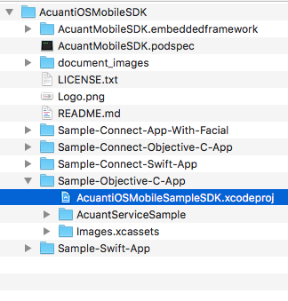
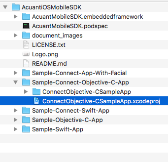

iOS Mobile SDK v5.9.2
==================

**November 2019**

==================

# Introduction

Acuant Web Services supports data extraction from driver’s licenses, state IDs, other government issued IDs, custom IDs, driver’s licenses, barcodes, passports, and medical insurance cards. It also supports document authentication and facial recognition to verify and authenticate the identity.

The Acuant Mobile SDK framework is a Cocoa Framework. CocoaPods is a dependency manager for  Objective-C, which automates and simplifies the process of using third-party libraries like the Acuant Mobile SDK in your projects. See Installing the SDK with CocoaPods.

This document contains a detailed description of all functions that developers need to integrate with the Acuant iOS Mobile SDK. The Acuant iOS Mobile SDK requires a valid license key. Contact sales@acuantcorp.com to obtain a license key.

**Note** The Framework will not modify the Status bar of the application.

##Operating system and device requirements
The Acuant iOS Mobile SDK API supports the following operating system
and devices:

**Operating System:** iOS 8.0 or later

**Devices:** iPhone 4S and later, iPad 3 and later, iPad mini, iPod Touch 5G and later

**Note**  The card image must be taken in acceptable light conditions to avoid glare and overhead lights. The card should preferably be fitted within the brackets on the camera screen to allow the picture to be taken at maximum resolution.

## Installing the SDK with CocoaPods

This section describes how to install the Acuant iOS Mobile SDK using CocoaPods.

**Note** GitHub has recently changed the versioning for large files. To be able to download large files while cloning from GitHub or CocoaPods repositories please make sure git-lfs is installed in the build machine.
More information for git-lfs is available at <https://git-lfs.github.com/>. Clone and update our SDK repository
*only* after the git-lfs is installed.

After cloning the repository, run the following command to make sure all files are pulled:

	git lfs pull
	
## Common Build Error

If git-lfs is not set up , then GitHub doesn't download large files. Therefore, if the following build error appears while building the iOS app, that means some of the files are missing. 

	ld: warning: ignoring file ../com.acuant.plugin.AcuantMobileSDK/AcuantMobileSDK.framework/AcuantMobileSDK, file was built for unsupported file format ( 0x76 0x65 0x72 0x73 0x69 0x6F 0x6E 0x20 0x68 0x74 0x74 0x70 0x73 0x3A 0x2F 0x2F ) which is not the architecture being linked (armv7): ../com.acuant.plugin.AcuantMobileSDK/AcuantMobileSDK.framework/AcuantMobileSDK
	Undefined symbols for architecture armv7:

	"_OBJC_CLASS_$_AcuantCardProcessRequestOptions", referenced from:

		objc-class-ref in AcuantMobileSDK.o

	"_OBJC_CLASS_$_AcuantMobileSDKController", referenced from:

		objc-class-ref in AcuantMobileSDK.o
	ld: symbol(s) not found for architecture armv7
	clang: error: linker command failed with exit code 1 (use -v to see invocation)
	
If the following error(s) occurs when publishing/exporting the app, then in the XCode build setting the architectures are not set correctly. You must either set valid CPU architectures or use the "lipo" command-line tool to remove the unsupported architecture library.

	lipo -remove i386 <Path to the file> -o <Output file path>
	lipo -remove x86_64 <Path to the file> -o <Output file path>

#### Create a Podfile: ####

1.  Create a podfile that includes the following lines:

	    platform :ios, '8.0'
		pod 'PPpdf417', '~> 5.1.0'
		pod 'AcuantMobileSDK', '~> 5.9.2'

2.  Run `pod install` to add the AcuantMobileSDK.

Check the below video for integration using COCOAPOD :

#### Add imports in the Objective-C bridging file *(optional)*: ####

If this is a Swift project, then add the following imports to the Objective-C bridging file.
(*Apple Reference:* <https://developer.apple.com/library/ios/documentation/Swift/Conceptual/BuildingCocoaApps/MixandMatch.html>)

		@protocol AcuantFacialCaptureDelegate;
		@class AcuantMobileSDKController;
 
 		#import <Foundation/Foundation.h>
		#import <UIKit/UIKit.h>
		#import "AcuantMobileSDK/AcuantCardProcessRequestOptions.h"
		#import "AcuantMobileSDK/AcuantCardRegion.h"
		#import "AcuantMobileSDK/AcuantCardResult.h"
		#import "AcuantMobileSDK/AcuantCardType.h"
		#import "AcuantMobileSDK/AcuantDeviceLocationTestResult.h"
		#import "AcuantMobileSDK/AcuantDriversLicenseCard.h"
		#import "AcuantMobileSDK/AcuantError.h"
		#import "AcuantMobileSDK/AcuantFacialCaptureDelegate.h"
		#import "AcuantMobileSDK/AcuantFacialData.h"
		#import "AcuantMobileSDK/AcuantFacialRecognitionViewController.h"
		#import "AcuantMobileSDK/AcuantMedicalInsuranceCard.h"
		#import "AcuantMobileSDK/AcuantMobileSDKController.h"
		#import "AcuantMobileSDK/AcuantPassaportCard.h"

#### Add the AcuantMobileSDK.embeddedframework *(Optional)*: ####
If you do not use CocoaPods, then you need to add the AcuantMobileSDK.embeddedframework into each of your projects. 

1. Download the Acuant iOS Mobile SDK and embeddedframework from GitHub at <https://github.com/Acuant/AcuantiOSMobileSDK>.
2. Drag the AcuantMobileSDK.embeddedframework folder into your project's file structure.

#### Add native frameworks and libraries: ####

1.  Go to the target. 
2.  Click **Build Phases**.
3.  Expand **Link binary with libraries**.
4.  Click the Xcode tool icon **(+)** to add the following frameworks and libraries.

#### Frameworks: ####

- CoreLocation.framework

#### Libraries: ####
- libc++.tdb
- libiconv.tdb
- libz.tdb

**Note:** Use .dylib for versions of Xcode earlier than 7.0.

- libc++.dylib
- libiconv.dylib
- libz.dylib

#### Add the Microblink bundle and framework to the project: ####

1. Download the Microblink.bundle and Microblink.framework files from **AcuantMobileSDK.embeddedframework/Resources**.
2. Add the files to the project: 
 
1. Then select the MicroBlink.framework as the embedded Binaries:
	
	

#### Change targets in build settings: ####

1.  Go to the target.
2.  Click **Build Settings**.
3.  Change following targets:

	    Set “C Language Dialect” with GNU99
    	Set “C++ Language Dialect” with Compiler Default
    	Set “C++ Standard Library” with Compiler Default

4. Change the following flags:

	    Add on “GCC_PREPROCESSOR_DEFINITIONS” = CVLIB_IMG_NOCODEC

## Integration with Swift

Before you integrate this SDK with a Swift project, you must first create an Objective-C bridging header to expose those files to Swift. After you add an Objective-C file, the Xcode will prompt you to create the header file. 

(*Apple Reference:* <https://developer.apple.com/library/ios/documentation/Swift/Conceptual/BuildingCocoaApps/MixandMatch.html>)

## Integration with Objective-C

Add the following import header to your **appDelegate** header file:

	    #import <AcuantMobileSDK/AcuantMobileSDKController.h>	

### Objective-C Sample Application

The Objective-C Sample application **AcuantiOSMobileSampleSDK.xcodeproj** is located in Sample-Objective-C-App:

**Note** You need a license key from Acuant to run the sample application. Contact Acuant Technical Support to obtain a license key.

### Swift Sample Application

The Swift Sample application is located in Sample-Swift-App:

**Note** You need a license key from Acuant to run the sample application. Contact Acuant Technical Support to obtain a license key.

### AssureID Connect Objective-C Sample Application 

The AssureID Connect Objective-C Sample application is located in:

**Note** You need a license key from Acuant to run the sample application. Contact Acuant Technical Support to obtain a license key.

### AssureID Connect Swift Sample Application

The AssureID Connect Swift Sample application is located in:

**Note:** You need the appropriate AssureID Connect credentials to run the sample application. Contact Acuant to obtain the credentials.

## Using the AcuFill FRM Sample Application for Data Capture

This sample application demonstrates data capture and facial match recognition (FRM) using AssureID Connect Web Services. This sample application is located in:

**Note:** You need the appropriate AssureID Connect credentials and an AcuFill license key to run the sample application.  Contact Acuant to obtain the credentials and license information.

#### Initialize and create the SDK instance with a license key:

Use the following call to validate the license key and create an SDK instance:

	//Obtain the main controller instance
	_instance = [AcuantMobileSDKController initAcuantMobileSDKWithLicenseKey:@"MyLicensekey"
	andDelegate:self];

**Note** This method verifies if the license key is valid and it returns an instance that can be used to reference the methods. Acuant recommends that you *create one instance per session* in order to optimize your resources.

#### Initialize and create the SDK instance with a license key and cloud address:

In the following call, a license key is validated and the instance is created (with the specified cloud address if you are hosting Acuant Web Services in your own data center). By default, the iOS MobileSDK communicates with the Acuant Data Center.

	//Obtain the main controller instance
	_instance = [AcuantMobileSDKController
	initAcuantMobileSDKWithLicenseKey:@"MyLicensekey" delegate:self
	andCloudAddress:@"cloud.myAddress.com"];

**Note** Do *not* include the “https://” as part of the cloud address. The correct form is:
	**cloud.myAddress.com**

**Note:** This method verifies if the license key is valid and it returns an instance that can be used to reference the methods. Acuant recommends that you *create one instance per session* in order to optimize your resources.

If your instance was created previously, use this call instead:

	//Obtain the main controller instance
	_instance = [AcuantMobileSDKController initAcuantMobileSDK];

#### Check for successful the license key validation:

To verify that the license key validation has finished or whether it was successful, call the following method  after the instance of the MobileSDK has been created:

	-(void)mobileSDKWasValidated:(BOOL)wasValidated{
		_wasValidated = wasValidated;
	}

#### Check SDK Controller validation:

To check whether the SDK Controller was already validated with a license key, call the following method:

	BOOL validated = [_instance isSDKValidated];

# Card Capture
------------------------------

To show the camera interface, select *manual capture interface* or *barcode capture interface*, depending on the card type. The following list describes the supported capture method for each card type.

- **AcuantCardTypeMedicalInsuranceCard** -- Manual only
- **AcuantCardTypePassportCard** -- Manual only
- **AcuantCardTypeDriversLicenseCard** -- Manual only or barcode only (based on the [region](#Region_parameter))
	- **U.S. and Canada** -- Manual only for front; Barcode or Manual for back 
	- **So. America, Europe, Asia, Australia, and Africa** -- Manual for front and back
- **AcuantCardTypeAuto** -- If AcuantCardTypeAuto is set, then in **didCaptureCropImage** the last parameter will contain the automatically detected card type. If a card type such as AcuantCardTypeDriversLicenseCard is set and a different card type such as AcuantCardTypePassportCard is detected, then an AcuantErrorIncorrectDocumentScanned error occurs.

#### Configure the SDK for the card capture interface:

1. Add the following import to the header file:

	    #import <AcuantMobileSDK/AcuantMobileSDKController.h>
    
2. In the same header file, implement the **AcuantMobileSDKControllerCapturingDelegate**:

	    @interface ISGViewController ()<AcuantMobileSDKControllerCapturingDelegate,
    	AcuantMobileSDKControllerProcessingDelegate>

## Card capture interface methods
Use one of the following methods to capture a card image.

####Initialize the SDK and show the camera interface:

Use the following method to initialize the SDK and show the camera interface in the same step:

	[AcuantMobileSDKController initAcuantMobileSDKWithLicenseKey:licenseKey
	AndShowCardCaptureInterfaceInViewController:self delegate:self
	typeCard:_cardType region:_region isBarcodeSide:_isBarcodeSide];

**Note**  Before you use any customization method, you should create a previous instance of the SDK in order to set the camera customization.

**Example**

	_instance = [AcuantMobileSDKController initAcuantMobileSDK];
	[_instance setWidth:1250];
	
	[AcuantMobileSDKController initAcuantMobileSDKWithLicenseKey:licenseKey 
	AndShowCardCaptureInterfaceInViewController:self 
	delegate:self
	typeCard:_cardType region:_region isBarcodeSide:_isBarcodeSide];

#### Use the Manual Card capture interface without initializing the SDK:

Call this function after you have already initialized the SDK. First create an instance of the SDK to call the function (see [AcuantMobileSDKController instance example](#Create_Instance_Example)).

	[_instance showManualCameraInterfaceInViewController:self delegate:self 
	cardType:_cardType region:_region andBackSide:YES];

#### Use the Barcode capture interface without initializing the SDK:

Call this function after you have already initialized the SDK. First create an instance of the SDK to call the function (see [AcuantMobileSDKController instance example](#Create_Instance_Example)).

	[_instance showBarcodeCameraInterfaceInViewController:self delegate:self 
	cardType:_cardType region:_region];

## Specifying the card size

If the proper card size is not set, MobileSDK will not be able to process the card.

##### Specify the card size for Driver's Licenses:

	-(void)showCameraInterface{
		if(_instance.isAssureIDAllowed){  	//If AssureId is enabled
        	[_instance setWidth:2024];
    	}else{
        	[_instance setWidth:1250];     	//If AssureId is not enabled
    	}
    }

##### Specify the card size for Medical Insurance Cards:

	-(void)showCameraInterface{ 
		[_instance setWidth:1500];
	}

##### Specify the card size for Passport documents:

	-(void)showCameraInterface{
		[_instance setWidth:1478];
	}

## Customize the display and message on the camera screen: 

The default initialization message reads: "*Align and Tap*" or “*Tap to Focus*”.
You can customize this message for Driver's License Front side, Driver's License Back side, Medical Insurance and Passport.

	[_instance setInitialMessage:@"Initial Message" frame:CGRectMake(0, 0, 0, 0)
	backgroundColor:[UIColor blueColor] duration:5.0 
	orientation:AcuantHUDLandscape];

The default capture message reads: "*hold steady*." You can customize this message for Driver's License Front Side and Medical Insurance cards.

	[_instance setCapturingMessage:@"Capturing Message"
	frame:CGRectMake(0,0,0, 0) backgroundColor:[UIColor blueColor] duration:5.0 
	orientation:AcuantHUDLandscape];

### Optional methods for cropping

The following are optional methods you can use to enable cropping (disabled by default). 

#### Crop the barcode image:
Use the **setCanCropBarcode** method to enable cropping the barcode image:

    [_instance setCanCropBarcode:YES];
	
Use the **canCropBarcodeOnBackPressed** method to enable cropping the barcode image on timeout or cancel:

	- (BOOL)canCropBarcodeOnBackPressed{
    	return NO;
	}	

**Note** The barcode cropped image will be received with the **didCaptureImage** delegate method.

### Enable the initial message displayed on the barcode camera interface:
Use the **setCanShowMessage** optional method to enable the initial message displayed on the barcode camera interface (disabled by default). 

	[_instance setCanShowMessage:YES];

####Enable pausing the barcode camera scan:
Use the **pauseScanningBarcodeCamera** optional method to pause the barcode camera scan.

	[_instance pauseScanningBarcodeCamera];

####Enable resuming the barcode camera scan:
Use the **resumeScanningBarcodeCamera** optional method to resume the barcode camera scan.

	[_instance resumeScanningBarcodeCamera];
	
###Enable the continuous scanning of barcodes without user preview:
Use the following optional method to use start or stop continuous scanning without user preview.

	// To Start Barcode scanning :
			
		- (void)startContinousBarcodeCaptureWithDelegate:(UIViewController<AcuantMobileSDKControllerCapturingDelegate>*)
		delegate;

	// To stop scanning :
		-(void)StopContinousBarcodeCapture;

###Tap to capture 2D Barcode:

By default the barcode is captured automatically as soon as a barcode is presented in front of the camera. If it is required to capture the barcode only after the user taps on the screen, then the following configuration can be done.

	-(BOOL)startScanningBarcodeAfterTap{
    	return YES; // Default is NO
	}

## Using the AcuantMobileSDKControllerCapturingDelegate protocol 

This section describes the methods used by the **AcuantMobileSDKControllerCapturingDelegate** protocol.

###didCaptureCropImage method###

Use the **didCaptureCropImage** method to configure image cropping.
 
**Note**  All card capture interfaces *must* use this method.

	-(void)didCaptureCropImage:(UIImage **)cardImage scanBackSide:(BOOL)scanBackSide andCardType:(AcuantCardType)cardType  withImageMetrics:(NSDictionary )imageMetrics

	{
		_isCameraTouched = NO;
		[_instance dismissCardCaptureInterface];
		_isBarcodeSide = scanBackSide;
		
		switch (_sideTouch) {
			
			case FrontSide:
				[_frontImage setImage:cardImage];
				break;
			
			case BackSide:
				[_backImage setImage:cardImage];
				[_frontImageLabel setText:@""];
				[_backImageLabel setText:@""];
				[self cardHolderPositions];
				_frontImage.layer.masksToBounds = YES;
				_frontImage.layer.cornerRadius = 10.0f;
				_frontImage.layer.borderWidth = 1.0f;
				_backImage.layer.masksToBounds = YES;
				_backImage.layer.cornerRadius = 10.0f;
				_backImage.layer.borderWidth = 1.0f;
				[_backImage setUserInteractionEnabled:YES];
				break;
			
			default:
				break;
		}
		
		[_sendRequestButton setEnabled:YES];
		[_sendRequestButton setHidden:NO];
		
		if (scanBackSide) {
		
			_sideTouch = BackSide;
			[UIAlertController showSimpleAlertWithTitle:@"AcuantiOSMobileSDKSample" 
			Message:@"Scan the backside of the license." 
			FirstButton:ButtonOK 
			SecondButton:nil 
			FirstHandler:^(UIAlertAction *action) {
				_sideTouch = BackSide;
				_isCameraTouched = YES;
				[self showCameraInterface];
			}
			SecondHandler:nil
			Tag:1
			ViewController:self];
		}
	}

The **ImageMetrics** parameter specifies the sharpness and glare threshold of a cropped image. An image with a sharpness grade of 0.4f or above is considered a sharp image. In general, a GLARE_GRADE of 1 means no glare and 0 means there is a high chance of having a glare in the captured image. Users may set the threshold based on their requirements:

		BOOL isSharp = [[imageMetrics objectForKey:@"IS_SHARP"] boolValue]; 
		float sharpnessGrade = [[imageMetrics objectForKey:@"SHARPNESS_GRADE"] floatValue]; 

		BOOL hasGlare = [[_imageMetrics objectForKey:@"HAS_GLARE"] boolValue] 
		float glareGrade = [[_imageMetrics objectForKey:@"GLARE_GRADE"] floatValue]; 

**Note** For **AcuantCardTypeMedicalInsuranceCard** capturing the back side is optional, but for **AcuantCardTypeDriverLicenseCard**, capturing the back side is required.

### didCaptureOriginalImage method

Use the **didCaptureOriginalImage** method to retrieve the original image captured by the card capture interface.

	-(void)didCaptureOriginalImage:(UIImage *)cardImage{
		_originalImage = cardImage;  
	}

#### didCaptureData delegate method

Use the **didCaptureData** method to retrieve the barcode string by the barcode capture interface for **AcuantCardTypeDriverLicenseCard**.

	-(void) didCaptureData:(NSString *)data{
		self.barcodeString = data;
	}
	
#### didCaptureCropImage:andData:scanBackSide: delegate method

Use the **didCaptureCropImage** method to retrieve the barcode string and the backside image by the barcode capture interface for **AcuantCardTypeDriverLicenseCard**:

	-(void)didCaptureCropImage:(UIImage *)cardImage andData:(NSString *)data 
	scanBackSide:(BOOL)scanBackSide{
	
	}

**Notes** 

- This delegate will be called only if **canCropBarcode** is set to **Yes** (for example,`[self.instance setCanCropBarcode:YES];`)
- Don’t implement both delegates, **didCaptureData** and **didCaptureCropImage:andData:scanBackSide**.

#### didFailWithError delegate method
In order to inform that the scan or the process failed. You must use the following method:

	-(void)didFailWithError:(AcuantError *)error{
		NSString *message;
		
		switch (error.errorType) {
		
			case AcuantErrorTimedOut:
				message = error.errorMessage;
				break;
			
			case AcuantErrorUnknown:
				message = error.errorMessage;
				break;
				
			case AcuantErrorUnableToProcess:
				message = error.errorMessage;
				break;
				
			case AcuantErrorInternalServerError:
				message = error.errorMessage;
				break;
				
			case AcuantErrorCouldNotReachServer:
			
			if (_isCameraTouched) {
				showAlert = NO;
			}
			
			message = error.errorMessage;
			break;
			
			case AcuantErrorUnableToAuthenticate:
				message = error.errorMessage;
				break;
				
			case AcuantErrorAutoDetectState:
				message = error.errorMessage;
				break;
				
			case AcuantErrorWebResponse:
				message = error.errorMessage;
				break;
			
			case AcuantErrorUnableToCrop:
				message = error.errorMessage;
				break;
				
			case AcuantErrorInvalidLicenseKey:
				message = error.errorMessage;
				break;
				
			case AcuantErrorInactiveLicenseKey:
				message = error.errorMessage;
				break;
				
			case AcuantErrorAccountDisabled:
				message = error.errorMessage;
				break;
				
			case AcuantErrorOnActiveLicenseKey:
				message = error.errorMessage;
				break;
				
			case AcuantErrorValidatingLicensekey:
				message = error.errorMessage;
				break;
				
			case AcuantErrorCameraUnauthorized:
				message = error.errorMessage;
				break;
				
			default:
				break;
		}
		
		if (showAlert) {
			[UIAlertController showSimpleAlertWithTitle:@"AcuantiOSMobileSDK" 
			Message:message 
			FirstButton:ButtonOK 
			SecondButton:nil 
			FirstHandler:^(UIAlertAction *action) {
				if (tag == 1) {
					_sideTouch = BackSide;
					_isCameraTouched = YES;
					[self showCameraInterface];
				}else if(tag == 7388467) {
					[[UIApplication sharedApplication] openURL:[NSURL 
					URLWithString:UIApplicationOpenSettingsURLString]];
				}
			}
		
			SecondHandler:nil
			Tag:tag
			ViewController:self];
		}
	}

### Optional delegate methods

#### didTakeCardPhoto method

Use the **didTakeCardPhoto** method to inform the delegate that the image capture process started:

		-(void)didTakeCardPhoto{
    			NSLog(@"didTakeCardPhoto");
    			//Custom code here.
			}

#### barcodeScanTimeOut method

Use the **barcodeScanTimeOut** method to inform the delegate that the time of the barcode scan expired:

		-(void)barcodeScanTimeOut:(UIImage*)croppedImage withImageMetrics:(NSDictionary *)imageMetrics andOriginalImage:(UIImage *)originalImage 

		}

The **ImageMetrics** parameter specifies the sharpness and glare threshold of a cropped image. An image with a sharpness grade of 0.4f or above is considered a sharp image. In general, a GLARE_GRADE of 1 means no glare and 0 means there is a high chance of having a glare in the captured image. Users may set the threshold based on their requirements:

		BOOL isSharp = [[imageMetrics objectForKey:@"IS_SHARP"] boolValue]; 
		float sharpnessGrade = [[imageMetrics objectForKey:@"SHARPNESS_GRADE"] floatValue]; 

		BOOL hasGlare = [[_imageMetrics objectForKey:@"HAS_GLARE"] boolValue] 
		float glareGrade = [[_imageMetrics objectForKey:@"GLARE_GRADE"] floatValue]; 

#### didCancelToCaptureData method

Use the **didCancelToCaptureData** method to inform the delegate that the barcode screen has been canceled:
**Note** For arguments that have images, the delegate must implement **-(BOOL)canCropBarcodeOnBackPressed** method and must return **Yes**.

		-(void)didCancelToCaptureData:(UIImage*)croppedImage withImageMetrics:(NSDictionary *)imageMetrics andOriginalImage:(UIImage *)originalImage{
		}
#### showiPadBrackets method

Use the **showiPadBrackets** method to enable or disable displaying the iPad brackets on the card capture interface:

		-(BOOL)showiPadBrackets{
		    return YES;   
		}

The **ImageMetrics** parameter specifies the sharpness and glare threshold of a cropped image. An image with a sharpness grade of 0.4f or above is considered a sharp image. In general, a GLARE_GRADE of 1 means no glare and 0 means there is a high chance of having a glare in the captured image. Users may set the threshold based on their requirements:

		BOOL isSharp = [[imageMetrics objectForKey:@"IS_SHARP"] boolValue]; 
		float sharpnessGrade = [[imageMetrics objectForKey:@"SHARPNESS_GRADE"] floatValue]; 

		BOOL hasGlare = [[_imageMetrics objectForKey:@"HAS_GLARE"] boolValue] 
		float glareGrade = [[_imageMetrics objectForKey:@"GLARE_GRADE"] floatValue]; 

#### didPressBackButton method

Use the **didPressBackButton** method to inform the delegate that the user pressed the **Back** button:
		
		-(void)didPressBackButton{
		   	[_instance dismissCardCaptureInterface];     
		}

#### imageForBackButton method

Use the **imageForBackButton** method to set the Back button image displayed in the card capture interface:

		-(UIImage*)imageForBackButton{
			UIImage *image = [UIImage imageNamed:@"BackButton.png"];
			return image;   
		}
		 
#### frameForBackButton	method
	 
Use the **frameForBackButton** method to set the back button position in the screen:

		-(CGRect)frameForBackButton{
		    return CGRectZero;     
		}

#### showBackButton method

Use the **showBackButton** method to enable or disable displaying the back button in the card capture interface:

		-(BOOL)showBackButton{
			return YES;
		}

#### cameraPrefersStatusBarHidden method

Use the **cameraPrefersStatusBarHidden** method to control the attributes of the status bar when this view controller is shown:

		-(BOOL)cameraPrefersStatusBarHidden{
     		return YES;
     	}

#### showFlashlightButton method

Use the **showFlashlightButton** method to enable or disable displaying  the flashlight button in the card capture interface:

	-(BOOL)showFlashlightButton{
	     return YES;
	} 

#### frameForFlashlightButton method

Use the **frameForFlashlightButton** method to set the flashlight button position in the screen:Call to set the flashlight button position in the screen:

		-(CGRect)frameForFlashlightButton{
 
			return CGRectZero;
     
		}

#### imageForFlashlightButton method

Use the **imageForFlashlightButton** method to set the flashlight button image displayed in the card capture interface when camera flash is turned on:
	
		-(UIImage*)imageForFlashlightButton{
     		UIImage *image = [UIImage imageNamed:@"FlashlightButton.png"];
     		return image;
		}

#### imageForFlashlightOffButton method

Use the **imageForFlashlightOffButton** method to set the flashlight button image displayed in the card capture interface when camera flash is turned off:

		-(UIImage*)imageForFlashlightOffButton{
			UIImage *image = [UIImage imageNamed:@"FlashlightOffButton.png"];
			return image;
		}

#### imageForHelpImageView method

Use the **imageForHelpImageView** method to set the help image displayed in the card capture interface:
	
		-(UIImage*)imageForHelpImageView{
     		UIImage *image = [UIImage imageNamed:@"PDF417"];   
			return [image imageByApplyingAlpha:0.7];    
		
		}

#### frameForHelpImageView method

Use the **frameForHelpImageView** method to set the help image position in the screen:

		-(CGRect)frameForHelpImageView{
			UIImage *image = [UIImage imageNamed:@"PDF417"]; 
			CGRect frame = CGRectMake(self.view.frame.size.width/2 -
			image.size.width/2, self.view.> frame.size.height/2 -
			image.size.height/3 , image.size.width, image.size.height);
	   		return frame;         
	 	}
	 
#### stringForWatermarkLabel method
	 
Use the **stringForWatermarkLabel** method to set the watermark Message displayed in the card capture interface:

		-(NSString*)stringForWatermarkLabel{
    		NSString *string = @"Powered by Acuant";
			return string;  
		}
 
#### frameForWatermarkImageView method
 
Use the **frameForWatermarkImageView** method to set the watermark label position on the screen:
		
		-(CGRect)frameForWatermarkImageView{
			UIImage *image = [UIImage imageNamed:@"Logo.png"];
			CGRect frame = CGRectMake(self.view.frame.size.width/2-
			image.size.width/2, self.view.> frame.size.height/2 -
			image.size.height/2 + 20 , image.size.width, image.size.height);
			return frame;   
		}

#### orientationForBarcodeErrorMessage method

Use the **orientationForBarcodeErrorMessage** method to set the orientation of barcode error message displayed in the barcode capture interface:

	 -(UIDeviceOrientation)orientationForBarcodeErrorMessage{
	 		return UIDeviceOrientationPortrait;
	 }

#### stringForBarcodeErrorMessage method

Use the **stringForBarcodeErrorMessage** method to set the barcode error message displayed in the barcode capture interface:

		-(NSString *)stringForBarcodeErrorMessage{
			NSString *string = @"Unable to scan the barcode?";
			return string; 
		}
		
#### stringForBarcodeTitleError method
		
Use the **stringForBarcodeTitleError** method to set the barcode title error displayed in the barcode capture interface:

		-(NSString *)stringForBarcodeTitleError{
     		NSString *string = @"Title Sample";
     		return string;    
		}
 
#### timeForBarcodeErrorMessage method

Use the **timeForBarcodeErrorMessage** method to set the time elapse to appear in the barcode capture interface:

		-(NSString *)stringForBarcodeFirstButton{ 
     		NSString *string = @"Yes";
     		return string;
    	} 
    
    
#### stringForBarcodeSecondButton method

Use the **stringForBarcodeSecondButton** method to set the barcode button text for the second button displayed in the barcode alert:

		-(NSString *)stringForBarcodeSecondButton{
			NSString *string = @"Try Again";
			return string;
		}

# Card Processing
----------------------------

This section describes the SDK configuration for the card capture interface and the card processing methods.

### SDK Configuration
Use the following procedure to configure the card capture interface.

1. Add the following import in the header file where you'll be doing the parsing:

	`#import <AcuantMobileSDK/AcuantMobileSDKController.h>`
2. In the same header file, implement the **AcuantMobileSDKControllerProcessingDelegate**.

	    @interface ISGViewController () <AcuantMobileSDKControllerCapturingDelegate,
    	**AcuantMobileSDKControllerProcessingDelegate**>
### Configure the SDK for the card capture interface.

## Card Processing Methods
This section details the card processing methods for driver's licenses, medical insurance cards, and passports.

### Card processing for Driver's Licenses

Use the following values to configure card processing for the **AcuantCardTypeDriverLicenseCard**:

		-(IBAction)sendRequest:(id)sender {
			self.view.userInteractionEnabled = NO;
			[SVProgressHUD showWithStatus:@"Sending Request"];
			
			//Obtain the front side of the card image
			UIImage *frontSideImage = [self frontSideCardImage];
			
			//Obtain the back side of the card image
			UIImage *backSideImage =[self backSideCardImage];
			
			//Obtain the default AcuantCardProcessRequestOptions object for the type of 
			card you want to process (Driver’s License card for this example)
			
			AcuantCardProcessRequestOptions *options = [AcuantCardProcessRequestOptions 
			defaultRequestOptionsForCardType: AcuantCardTypeDriversLicenseCard];
			
			//Optionally, configure the options to the desired value
			
			options.autoDetectState = YES;
			options.stateID = -1;
			options.reformatImage = YES;
			options.reformatImageColor = 0;
			options.DPI = 150.0f;
			options.cropImage = NO;
			options.faceDetection = YES;
			options.signatureDetection = YES;
			options.region = _regionID;
			// Now, perform the request
			[_instance processFrontCardImage:frontSideImage 
			BackCardImage:backSideImage 
			andStringData:_barcodeString 
			withDelegate:self
			withOptions:options];
		}
###Parameters

####region
Integer parameter for the Region ID.   **Values**: United States – 0 | Australia – 4 | Asia – 5 | 
Canada – 1 | America – 2 | Europe – 3 | Africa – 7 | General Documents – 6

####autoDetectState
Boolean value that indicates whether to auto detect the state of the ID.  **Values:** True | False (SDK won't auto detect the state of the ID and will use the value of ProcState integer)

####stateID
Integer value of the state to which the ID belongs

	- If **AutoDetectState** is True, then the SDK automatically detects the state of the ID and **stateID** value is ignored.
	- If **AutoDetectState** is False, then the SDK uses the **stateID** integer value for processing. 

	**Note** For a complete list of the different countries supported by the SDK and their different State integer values, see the ScanW document: <http://www.id-reader.com/ftp/applications/sdk/docs/ScanW.pdf>

####faceDetection
Boolean value that indicates whether a face image is returned. **Values:** True | False

####signatureDetection
Boolean value that indicates whether a signature image is returned. **Values:** True | False

####reformatImage
Boolean value  that indicates whether a formatted image is returned. **Values:** True | False (ignores value of **ReformatImageColor** and **ReformatImageDpi**)

####reformatImageColor
Integer value that specifies the color value to reformat the image. **Values:** Image same color – 0 | Black and White – 1 | Gray scale 256 – 2 | Color 256 – 3 | True color – 4 | Enhanced Image – 5

####DPI
Integer value that indicates the DPI value to reformat the image. **Values:** Range is 150 - 600. The size of the image is dependent on the DPI value. Use a lower value (150) for a smaller image.

####cropImage
Boolean value that indicates whether to crop the RAW image. **Values:** True | False 

	**Note:** MobileSDK crops the image; therefore, leave this flag set to **False**.

####logtransaction
 Boolean value that indicates whether to save the transaction response on the Acuant cloud for future retrieval if logging is enabled on the license key. **Values:** True | False 

####imageSettings
The default value for **imageSettings** is -1. Do not adjust this value unless instructed by Acuant Technical Support.

### Card processing for Medical Insurance Cards

Use the following values to configure card processing for **AcuantCardTypeMedicalInsuranceCard**.

	-(IBAction)sendRequest:(id)sender {
		self.view.userInteractionEnabled = NO;
		[SVProgressHUD showWithStatus:@"Sending Request"];
		
		//Obtain the front side of the card image
		UIImage *frontSideImage = [self frontSideCardImage];
		
		//Optionally, Obtain the back side of the image
		UIImage *backSideImage =[self backSideCardImage];
		
		//Obtain the default AcuantCardProcessRequestOptions object for the type of card 
		you want to process (Medical Insurance card for this example)
		
		AcuantCardProcessRequestOptions *options = [AcuantCardProcessRequestOptions
		defaultRequestOptionsForCardType: AcuantCardTypeMedicalInsuranceCard];
		
		//Optionally, configure the options to the desired value
		options.reformatImage = YES;
		options.reformatImageColor = 0;
		options.DPI = 150.0f;
		options.cropImage = NO;
		
		// Now, perform the request
		[_instance processFrontCardImage:frontSideImage 
		BackCardImage:backSideImage andStringData:nil withDelegate:self 
		withOptions:options];
	}

###Parameters

####reformatImage
Boolean value  that indicates whether a formatted image is returned. **Values:** True | False (ignores value of **ReformatImageColor** and **ReformatImageDpi**)

####reformatImageColor
Integer value that specifies the color value to reformat the image. **Values:** Image same color – 0 | Black and White – 1 | Gray scale 256 – 2 | Color 256 – 3 | True color – 4 | Enhanced Image – 5

####DPI
Integer value that indicates the DPI value to reformat the image. **Values:** Range is 150 - 600. The size of the image is dependent on the DPI value. Use a lower value (150) for a smaller image.

####cropImage
Boolean value that indicates whether to crop the RAW image. **Values:** True | False 

	**Note:** MobileSDK crops the image; therefore, leave this flag set to **False**.

### Card processing for Passports

Use the following values to configure card processing for **AcuantCardTypePassportCard**:

		-(IBAction)sendRequest:(id)sender {
			self.view.userInteractionEnabled = NO;
			[SVProgressHUD showWithStatus:@"Sending Request"];
		
			//Obtain the front side of the card image
			UIImage *frontSideImage = [self frontSideCardImage];
		
			//Obtain the default AcuantCardProcessRequestOptions object for the type
			of card you want to process (Passport card for this example)
		
			AcuantCardProcessRequestOptions *options =
			[AcuantCardProcessRequestOptions defaultRequestOptionsForCardType:
			AcuantCardTypePasssportCard];
		
			//Optionally, configure the options to the desired value
			options.reformatImage = YES;
			options.reformatImageColor = 0;
			options.DPI = 150.0f;
			options.cropImage = NO;
			options.faceDetection = YES;
			options.signatureDetection = YES;
			// Now, perform the request
		
			[_instance processFrontCardImage:frontSideImage BackCardImage:nil 
			andStringData:nil withDelegate:self withOptions:options];
		}

###Parameters

####faceDetection
Boolean value that specifies whether to return a face image. **Values**: True | False

####signatureDetection
Boolean value that specifies whether to return a  signature image. **Values**: True | False

####reformatImage
Boolean value  that indicates whether a formatted image is returned. **Values:** True | False (ignores value of **ReformatImageColor** and **ReformatImageDpi**)

####reformatImageColor
Integer value that specifies the color value to reformat the image. **Values:** Image same color – 0 | Black and White – 1 | Gray scale 256 – 2 | Color 256 – 3 | True color – 4 | Enhanced Image – 5

####DPI
 Integer value that indicates the DPI value to reformat the image. **Values:** Range is 150 - 600. The size of the image is dependent on the DPI value. Use a lower value (150) for a smaller image.

####cropImage
Boolean value that indicates whether to crop the RAW image. **Values:** True | False 
**Note:** MobileSDK crops the image; therefore, leave this flag set to **False**.

## Using the AcuantMobileSDKControllerProcessingDelegate protocol

This section describes the configuration for using the **AcuantMobileSDKControllerProcessingDelegate** protocol to handle the processing for driver's licenses, medical insurance cards, and passports.

### Processing Driver's License Cards

Add the following code for the **AcuantCardTypeDriversLicenseCard**:

	#pragma mark -
	#pragma mark CardProcessing Delegate

		-(void)didFinishProcessingCardWithResult:(AcuantCardResult *)result{
    		self.view.userInteractionEnabled = YES;
    		[SVProgressHUD dismiss];
    		NSString *message;
    		UIImage *faceimage;
    		UIImage *signatureImage;
    		UIImage *frontImage;
    		UIImage *backImage;
    		AcuantDriversLicenseCard *data = (AcuantDriversLicenseCard*)result;
    		message [NSString stringWithFormat:@"First Name - %@ \nMiddle Name - %@ \nLast Name - 		%@ 	\nName Suffix - %@ \nAuthentication Result - %@ \nAunthentication Summary - %@ 		\nID - 	%@ 	\nLicense - %@ \nDOB Long - %@ \nDOB Short - %@ \nDate Of Birth Local - %@ 		\nIssue 	Date 	Long - %@ \nIssue Date Short - %@ \nIssue Date Local - %@ 		\nExpiration Date Long - 	%@ 	\nExpiration Date Short - %@ \nEye Color - %@ \nHair 		Color - %@ \nHeight - %@ \nWeight 	- 	%@ \nAddress - %@ \nAddress 2 - %@ \nAddress 3 		- %@ \nAddress 4 - %@ \nAddress 5 - %@ 		\nAddress 6  - %@ \nCity - %@ \nZip - %@ \nState - %@ \nCounty - %@ \nCountry Short - 		%@ 	\nCountry Long - %@ \nClass - %@ \nRestriction - %@ \nSex - %@ \nAudit - %@ 		\nEndorsements 	- %@ \nFee - %@ \nCSC - %@ \nSigNum - %@ \nText1 - %@ \nText2 - %@ 		\nText3 - %@ \nType - 	%@ \nDoc Type - %@ \nFather Name - %@ \nMother Name - %@ 		\nNameFirst_NonMRZ - %@ 	\nNameLast_NonMRZ - %@ \nNameLast1 - %@ \nNameLast2 - %@ 		\nNameMiddle_NonMRZ - %@ 	\nNameSuffix_NonMRZ - %@ \nDocument Detected Name - %@ 		\nDocument Detected Name Short - %@ 	\nNationality - %@ \nOriginal - %@ 		\nPlaceOfBirth - %@ \nPlaceOfIssue - %@ \nSocial 		Security - %@ \nIsAddressCorrected - %d \nIsAddressVerified - %d", data.nameFirst, 		data.nameMiddle, data.nameLast, data.nameSuffix,data.authenticationResult,[self 		arrayToString:data.authenticationResultSummaryList], data.licenceId, data.license, 		data.dateOfBirth4, data.dateOfBirth, data.dateOfBirthLocal, data.issueDate4, 		data.issueDate, data.issueDateLocal, data.expirationDate4, data.expirationDate, 		data.eyeColor, data.hairColor, data.height, data.weight, data.address, data.address2, 		data.address3, data.address4, data.address5, data.address6, data.city, data.zip, 		data.state, data.county, data.countryShort, data.idCountry, data.licenceClass, 		data.restriction, data.sex, data.audit, data.endorsements, data.fee, data.CSC, 		data.sigNum, data.text1, data.text2, data.text3, data.type, data.docType, 		data.fatherName, 	data.motherName, data.nameFirst_NonMRZ, data.nameLast_NonMRZ, 		data.nameLast1, 	data.nameLast2, data.nameMiddle_NonMRZ, data.nameSuffix_NonMRZ, 		data.documentDetectedName, 	data.documentDetectedNameShort, data.nationality, 		data.original, data.placeOfBirth, 	data.placeOfIssue, data.socialSecurity, 		data.isAddressCorrected, data.isAddressVerified];

		if (_region == AcuantCardRegionUnitedStates || _region == AcuantCardRegionCanada) {
            message = [NSString stringWithFormat:@"%@ \nIsBarcodeRead - %hhd \nIsIDVerified - 			%hhd \nIsOcrRead - %hhd", message, data.isBarcodeRead, data.isIDVerified, 			data.isOcrRead];
		}
    
    	faceimage = [UIImage imageWithData:data.faceImage];
    	signatureImage = [UIImage imageWithData:data.signatureImage];
    	frontImage = [UIImage imageWithData:data.licenceImage];
    	backImage = [UIImage imageWithData:data.licenceImageTwo]

	}

		-(void)didFailWithError:(AcuantError *)error{
    		self.view.userInteractionEnabled = YES;
    		[SVProgressHUD dismiss];
    		NSString *message;
    		switch (error.errorType) {
        		case AcuantErrorTimedOut:
            		message = error.errorMessage;
            		break;
        		case AcuantErrorUnknown:
            		message = error.errorMessage;
            		break;
        		case AcuantErrorUnableToProcess:
            		message = error.errorMessage;
            		break;
        		case AcuantErrorInternalServerError:
            		message = error.errorMessage;
            		break;
        		case AcuantErrorCouldNotReachServer:
            		message = error.errorMessage;
            		break;
        		case AcuantErrorUnableToAuthenticate:
            		message = error.errorMessage;
            		break;
        		case AcuantErrorAutoDetectState:
            		message = error.errorMessage;
            		break;
        		case AcuantErrorWebResponse:
            		message = error.errorMessage;
            		break;
        		case AcuantErrorUnableToCrop:
            		message = error.errorMessage;
            		break;
        		case AcuantErrorInvalidLicenseKey:
           			message = error.errorMessage;
            		break;
        		case AcuantErrorInactiveLicenseKey:
            		message = error.errorMessage;
            		break;
        		case AcuantErrorAccountDisabled:
            		message = error.errorMessage;
            		break;
        		case AcuantErrorOnActiveLicenseKey:
            		message = error.errorMessage;
            		break;
        		case AcuantErrorValidatingLicensekey:
            		message = error.errorMessage;
            		break;
        		case AcuantErrorCameraUnauthorized:
            		message = error.errorMessage;
            		break;
        		default:
            		break;
    		}
    

    [UIAlertController showSimpleAlertWithTitle:@"AcuantiOSMobileSDK"
                                        Message:message
                                    FirstButton:ButtonOK
                                   SecondButton:nil
                                   FirstHandler:^(UIAlertAction *action) {
                                       if (tag == 1) {
                                           _sideTouch = BackSide;
                                           _isCameraTouched = YES;
                                           [self showCameraInterface];
                                       }else if(tag == 7388467) {
                                           [[UIApplication sharedApplication] openURL:[NSURL URLWithString:UIApplicationOpenSettingsURLString]];
                                       }
                                   }
                                  SecondHandler:nil
                                            Tag:tag
                                 ViewController:self];
}

### Processing Medical Insurance Cards

Add the following code for the **AcuantCardTypeMedicalInsuranceCard**:

	#pragma mark -
	#pragma mark CardProcessing Delegate
	-(void)didFinishProcessingCardWithResult:(AcuantCardResult *)result{
    self.view.userInteractionEnabled = YES;
    [SVProgressHUD dismiss];
    NSString *message;
    UIImage *faceimage;
    UIImage *signatureImage;
    UIImage *frontImage;
    UIImage *backImage;
    AcuantMedicalInsuranceCard *data = (AcuantMedicalInsuranceCard*)result;
    message =[NSString stringWithFormat:@"First Name - %@ \nLast Name - %@ \nMiddle Name - %@ \nMemberID - %@ \nGroup No. - %@ \nContract Code - %@ \nCopay ER - %@ \nCopay OV - %@ \nCopay SP - %@ \nCopay UC - %@ \nCoverage - %@ \nDate of Birth - %@ \nDeductible - %@ \nEffective Date - %@ \nEmployer - %@ \nExpire Date - %@ \nGroup Name - %@ \nIssuer Number - %@ \nOther - %@ \nPayer ID - %@ \nPlan Admin - %@ \nPlan Provider - %@ \nPlan Type - %@ \nRX Bin - %@ \nRX Group - %@ \nRX ID - %@ \nRX PCN - %@ \nTelephone - %@ \nWeb - %@ \nEmail - %@ \nAddress - %@ \nCity - %@ \nZip - %@ \nState - %@", data.firstName, data.lastName, data.middleName, data.memberId, data.groupNumber, data.contractCode, data.copayEr, data.copayOv, data.copaySp, data.copayUc, data.coverage, data.dateOfBirth, data.deductible, data.effectiveDate, data.employer, data.expirationDate, data.groupName, data.issuerNumber, data.other, data.payerId, data.planAdmin, data.planProvider, data.planType, data.rxBin, data.rxGroup, data.rxId, data.rxPcn, data.phoneNumber, data.webAddress, data.email, data.fullAddress, data.city, data.zip, data.state];

    frontImage = [UIImage imageWithData:data.reformattedImage];
    backImage = [UIImage imageWithData:data.reformattedImageTwo];
	}

	-(void)didFailWithError:(AcuantError *)error{
    self.view.userInteractionEnabled = YES;
    [SVProgressHUD dismiss];
    NSString *message;
    switch (error.errorType) {
        case AcuantErrorTimedOut:
            message = error.errorMessage;
            break;
        case AcuantErrorUnknown:
            message = error.errorMessage;
            break;
        case AcuantErrorUnableToProcess:
            message = error.errorMessage;
            break;
        case AcuantErrorInternalServerError:
            message = error.errorMessage;
            break;
        case AcuantErrorCouldNotReachServer:
            message = error.errorMessage;
            break;
        case AcuantErrorUnableToAuthenticate:
            message = error.errorMessage;
            break;
        case AcuantErrorAutoDetectState:
            message = error.errorMessage;
            break;
        case AcuantErrorWebResponse:
            message = error.errorMessage;
            break;
        case AcuantErrorUnableToCrop:
            message = error.errorMessage;
            break;
        case AcuantErrorInvalidLicenseKey:
            message = error.errorMessage;
            break;
        case AcuantErrorInactiveLicenseKey:
            message = error.errorMessage;
            break;
        case AcuantErrorAccountDisabled:
            message = error.errorMessage;
            break;
        case AcuantErrorOnActiveLicenseKey:
            message = error.errorMessage;
            break;
        case AcuantErrorValidatingLicensekey:
            message = error.errorMessage;
            break;        
        case AcuantErrorCameraUnauthorized:
            message = error.errorMessage;
            break;
        
        default:
            break;
    }
    [UIAlertController showSimpleAlertWithTitle:@"AcuantiOSMobileSDK"
                                        Message:message
                                    FirstButton:ButtonOK
                                   SecondButton:nil
                                   FirstHandler:^(UIAlertAction *action) {
                                       if (tag == 1) {
                                           _sideTouch = BackSide;
                                           _isCameraTouched = YES;
                                           [self showCameraInterface];
                                       }else if(tag == 7388467) {
                                           [
                                           [UIApplication sharedApplication] openURL:											[NSURL 
                                       URLWithString:UIApplicationOpenSettingsURLString]
                                           ];
                                       }
                                   }
                                  SecondHandler:nil
                                            Tag:tag
                                 ViewController:self];
}

### Processing Passports

Add the following code for the **AcuantCardTypePassportCard**:
		
	#pragma mark -
	#pragma mark CardProcessing Delegate
	-(void)didFinishProcessingCardWithResult:(AcuantCardResult *)result{
    self.view.userInteractionEnabled = YES;
    [SVProgressHUD dismiss];
    NSString *message;
    UIImage *faceimage;
    UIImage *signatureImage;
    UIImage *frontImage;
    UIImage *backImage;
    AcuantPassaportCard *data = (AcuantPassaportCard*)result;
    message =[NSString stringWithFormat:@"First Name - %@ \nMiddle Name - %@ \nLast Name
    - %@ \nAuthentication Result - %@ \nAunthentication Summary - %@ \nPassport Number -
    %@ \nPersonal Number - %@ \nSex - %@ \nCountry Long - %@ \nNationality Long - %@
    \nDOB Long - %@ \nIssue Date Long - %@ \nExpiration Date Long - %@ \nPlace of Birth -
    %@", data.nameFirst, data.nameMiddle, data.nameLast,data.authenticationResult,[self
    arrayToString:data.authenticationResultSummaryList], data.passportNumber,
    data.personalNumber, data.sex, data.countryLong, data.nationalityLong,
    data.dateOfBirth4, data.issueDate4, data.expirationDate4, data.end_POB];
        
    faceimage = [UIImage imageWithData:data.faceImage];
    frontImage = [UIImage imageWithData:data.passportImage];

    }

	-(void)didFailWithError:(AcuantError *)error{
    self.view.userInteractionEnabled = YES;
    [SVProgressHUD dismiss];
    NSString *message;
    switch (error.errorType) {
        case AcuantErrorTimedOut:
            message = error.errorMessage;
            break;
        case AcuantErrorUnknown:
            message = error.errorMessage;
            break;
        case AcuantErrorUnableToProcess:
            message = error.errorMessage;
            break;
        case AcuantErrorInternalServerError:
            message = error.errorMessage;
            break;
        case AcuantErrorCouldNotReachServer:
            message = error.errorMessage;
            break;
        case AcuantErrorUnableToAuthenticate:
            message = error.errorMessage;
            break;
        case AcuantErrorAutoDetectState:
            message = error.errorMessage;
            break;
        case AcuantErrorWebResponse:
            message = error.errorMessage;
            break;
        case AcuantErrorUnableToCrop:
            message = error.errorMessage;
            break;
        case AcuantErrorInvalidLicenseKey:
            message = error.errorMessage;
            break;
        case AcuantErrorInactiveLicenseKey:
            message = error.errorMessage;
            break;
        case AcuantErrorAccountDisabled:
            message = error.errorMessage;
            break;
        case AcuantErrorOnActiveLicenseKey:
            message = error.errorMessage;
            break;
        case AcuantErrorValidatingLicensekey:
            message = error.errorMessage;
            break;
        case AcuantErrorCameraUnauthorized:
            message = error.errorMessage;
            break;
        default:
            break;
    }
    [UIAlertController showSimpleAlertWithTitle:@"AcuantiOSMobileSDK"
                                        Message:message
                                    FirstButton:ButtonOK
                                   SecondButton:nil
                                   FirstHandler:^(UIAlertAction *action) {
                                       if (tag == 1) {
                                           _sideTouch = BackSide;
                                           _isCameraTouched = YES;
                                           [self showCameraInterface];
                                       }else if(tag == 7388467) {
                                           [[UIApplication sharedApplication] openURL:
                                           [NSURL 
                                      URLWithString:UIApplicationOpenSettingsURLString]];
                                       }
                                   }
                                  SecondHandler:nil
                                            Tag:tag
                                 ViewController:self];
	}

	//Function to convert Authentication Summary list to a single NSString object
	-(NSString*)*arrayToString:(NSArray*)*array{
    	NSString* retStr = @"";
    	for(NSString* str in array){
        	if([retStr isEqualToString:@""]){
            	retStr = str;
        	}else{
            	retStr = [NSString stringWithFormat:@"%@,%@",retStr,str];
        	}
    	}
    	return retStr;
	}
	
	
# AssureID Authentication

The **AuthenticationResult** and **AuthenticationResultSummary** fields contain the AssureID authentication results for Driver's Licenses and Passports. 

- **AuthenticationResult –** Returns one of the following values: Passed | Failed | Attention | Unknown | Skipped

- **AuthenticationResultSummary –** Contains a reason when **AuthenticationResult** has a value of Attention.

**Note** The value of **AuthenticationResultSummary** will be empty for any result other than Attention (Passed, Failed, Unknown, or Skipped).

# Tracking Capture Device Location

Use the following code to enable location tracking if you need to detect the location at which the ID/Passport is captured:

// Initializing AcuantMobileSDKController
		self.instance = [AcuantMobileSDKController 
		initAcuantMobileSDKWithLicenseKey:licenseKey andDelegate:self];
		.
		.
		.
    	// Enabling location tracking
		[self.instance enableLocationTracking];
		
		
	
**Note** Add the below key and a value for it in the application .plist file to enable location tracking.

		NSLocationAlwaysUsageDescription

##Location details

The following methods return location details:

			/*	To get the location details*/
			[_instance getDeviceStreetAddress]// Street address of device location
			[_instance getDeviceArea] // Area of the device location
			[_instance getDeviceCity] // City of the device location
			[_instance getDeviceState] // State of the device location
			[_instance getDeviceCountry]] // Country of the device location
			[_instance getDeviceCountryCode]// Country code of the device location
			[_instance getDeviceZipCode] // zipcode of the device location
			
The following enum is introduced for location test results:

			typedef enum {
    			AcuantDeviceLocationTestFailed = 0,  
    			AcuantDeviceLocationTestPassed = 1,
    			AcuantDeviceLocationTestNotAvailable = 2,
			} AcuantDeviceLocationTestResult;

The following location test fields are used by the **AcuantCardResult** class:
			
			@property (nonatomic) AcuantDeviceLocationTestResult  idLocationStateTestResult;
			@property (nonatomic) AcuantDeviceLocationTestResult 
			idLocationCountryTestResult;
			@property (nonatomic) AcuantDeviceLocationTestResult  idLocationCityTestResult;
			@property (nonatomic) AcuantDeviceLocationTestResult  idLocationZipcodeTestResult;
			

The following fields return AssureID authentication results:

- **AuthenticationResult –** Returns one of the following values: Passed | Failed | Attention | Unknown | Skipped

- **AuthenticationResultSummary –** Contains a reason when **AuthenticationResult** has a value of **Attention**.

**Note** The value of **AuthenticationResultSummary** will be empty for any result other than Attention (Passed, Failed, Unknown, or Skipped).

#	Facial Recognition Match (FRM)

Acuant Facial Recognition Match (FRM) is a person authentication solution for mobile devices based on biometric facial recognition that reduces fraud by matching the facial biometrics to the face image on a driver’s license or passport. It is secure, convenient, and easy to integrate, and performs real time checks and processing within seconds.

Acuant FRM does the following: 

-	Opens the front camera
-	Ensures the user is correctly placed in front of the camera
-	Detects a live person 
-	Detects spoofing attacks by presenting eye blink challenge 
-	Acquires biometric samples
-   Verifies the identity of a user

Acuant FRM performs following checks to recognize a live face and match face biometrics to the face picture on the driver’s license or passport.

- **Face position checks** - Checks that the face is well detected, correctly centered, and a good distance from the camera. Distance-to-person algorithm ensures that person’s face is at optimal distance from the front camera. Ensures that person is only presenting frontal face (Side faces are rejected).

- **Tracks eye blinks** as an added layer to check for face liveliness and avoid spoofing attacks.

- **Captures face biometric**s and matches it to the face picture on the driver’s license or passport.

The following APIs/Classes are used for FRM.

## AcuantFacialCaptureDelegate class

The **AcuantFacialCaptureDelegate** class is the delegate used to get the call back from the SDK interface.

- Called when a live face is successfully recognized. **Note**  The `image` parameter contains the face image recognized by facial recognition.

		-(void)didFinishFacialRecognition:(UIImage*)image;

- Called when the user cancels facial recognition:

		-(void)didCancelFacialRecognition

- Sets the facial recognition timeout, in seconds:

		-(int)facialRecognitionTimeout{
			return 20;
		}

- Control comes here when user taps on **Yes** on the facial timeout alert. The  **lastImage** argument is the last frame image before timeout:
	
		-(void)didTimeoutFacialRecognition:(UIImage*)lastImage

- Specify to show alert or dismiss facial interface immediately after facial timeout.

		-(BOOL)shouldShowFacialTimeoutAlert{
    		return true;  // true for showing alert , false for not showing alet and dismiss immidiately
   		}
   		
- Provides custom image for facial screen **Back** button:

		-(UIImage*)imageForFacialBackButton

- Displays custom message after red rectangle appears:

		-(NSAttributedString*)messageToBeShownAfterFaceRectangleAppears;

- Specifies where **messageToBeShownAfterFaceRectangleAppears** appears on the camera screen:
		
		-(CGRect)frameWhereMessageToBeShownAfterFaceRectangleAppears;

##	AcuantFacialRecognitionViewController class
	
This class contains the following **utility** method, which can be called to present the facial recognition interface.

		+(id)presentFacialCaptureInterfaceWithDelegate
		(id<AcuantFacialCaptureDelegate>)delegate withSDK:
		(AcuantMobileSDKController*)sdkController inViewController:
		(UIViewController*)parentVC withCancelButton:(BOOL)cancelVisible
		withCancelButtonRect:(CGRect) cancelRect
		withWaterMark:(NSString* )watermarkText
		withBlinkMessage:(NSAttributedString*)message
		inRect:(CGRect)rect;

###Parameters

####(id<AcuantFacialCaptureDelegate>)delegate
Delegate where the control is to be returned

####(AcuantMobileSDKController)sdkController
The SDK controller

####(UIViewController)parentVC
Parent view controller that presents the camera interface

####(BOOL)cancelVisible
Indicates whether to show **Cancel** button

####(CGRect) cancelRect
Indicates location of **Cancel** button

####(NSString)watermarkText
Brand watermark text

####(NSAttributedString)message
Instruction message (for example, “Blink Slowly”)

####(CGRect)rect
Frame in which instruction to be shown within the camera interface

### Facial Match function call

	/**
 	Use this method to do facial match.
 	@param selfieImage The captured selfie Image.
 	@param IDFaceImage Face Image from ID or Passport card
 	@param delegate the delegate of the process request
	 @param options the options of the process request.
 	@discussion you must always provide a selfieImage and a face image to match
 	@discussion use the options object to indicate the type as AcuantCardTypeFacial. Processing will fail if you don't provide this parameter.
 	@discussion you're encourage to provide a delegate to be informed about what happened with your processing request. You can change the delegate using the cardProcessingDelegate property of this class.
 	@discussion you should call this method only once and wait until your delegate is informed. If you call this method while we're already processing a card, we'll ignore your second call.
 	*/

	-(void)validatePhotoOne:(UIImage *)selfieImage
              withImage:(NSData *)IDFaceImage
           withDelegate:(id<AcuantMobileSDKControllerProcessingDelegate>)delegate
            withOptions:(AcuantCardProcessRequestOptions*)option;

The facial match function call can be made the same way as the other card processing function calls. 

**Example**
    
    	//Face Image
    	UIImage *selfiImage = image;
    	//DL/Passport Photo
    	NSData *faceImageData =_resultViewController.faceImageData;
    
		//Obtain the default AcuantCardProcessRequestOptions object for the type of card you want to process (License card for this example)
		
		AcuantCardProcessRequestOptions *options = [AcuantCardProcessRequestOptions defaultRequestOptionsForCardType:AcuantCardTypeFacial];
    
	[self.instance validatePhotoOne:selfieImage withImage:faceImageData withDelegate:<Delegate the control should come back> withOptions:options];

- The first parameter is the face image returned in the callback:

		-(void)didFinishFacialRecognition:(UIImage*)image;

- The second parameter is the face image from the ID/Passport against which the face image needs to be matched.
3.	Delegate is the web service delegate where the control will be after the function call returns.

4.	**AcuantCardProcessRequestOptions** is the last argument which is initialized with card type as **AcuantCardTypeFacial** as shown above.

4.	The following delegate method will be called after the function call returns

		- (void)didFinishValidatingImageWithResult:(AcuantCardResult*)cardResult{
    	AcuantFacialData* result =(AcuantFacialData*)cardResult;
        }

##AcuantFacialData property
The **AcuantFacialData** property has the following parameters:

####isMatch	
Indicates whether both images matched

    @property (nonatomic, assign) BOOL  isMatch ; // If both images matched

####isFacialEnabled
Indicates whether the facial feature is enabled

	@property (nonatomic, assign) BOOL  isFacialEnabled;// If facial feature is enabled
####faceLivelinessDetection
Indicates whether a live face was detected

    @property (nonatomic, assign) BOOL  faceLivelinessDetection; // If a live face was detected

####transactionId
String that specifies the facial match transaction ID

    @property (nonatomic, strong) NSString  *transactionId; // Facial match transaction id

####errorMessage
String that contains any service error description

**Note**  If the transaction was processed successfully then this field will be null.  	

    @property (nonatomic, strong) NSString  *errorMessage; // Any service error description. If the transaction has gone through successfully then this field will be null.

####facialMatchConfidenceRating
Integer that specifies the confidence level of the match as a value from 1 - 100	

# Error Types
The following errors may be generated:

####AcuantErrorCouldNotReachServer = 0
Check internet connection

####AcuantErrorUnableToAuthenticate = 1 
KeyLicense are incorrect

####AcuantErrorUnableToProcess = 2 
Image received by the server was unreadable, take a new one

####AcuantErrorInternalServerError = 3 
There was an error in our server, try again later

####AcuantErrorUnknown = 4 
There was an error but we were unable to determine the reason, try again later

####AcuantErrorTimedOut = 5 
Request timed out, maybe because Internet connection is too slow

####AcuantErrorAutoDetectState = 6
Error when try to detect the state

####AcuantErrorWebResponse = 7
The JSON was received by the server contained an error

####AcuantErrorUnableToCrop = 8
The received image can't be cropped

####AcuantErrorInvalidLicenseKey = 9
Invalid license key

####AcuantErrorInactiveLicenseKey = 10 
Inactive license key

####AcuantErrorAccountDisabled = 11
Account disabled

####AcuantErrorOnActiveLicenseKey = 12
There was an error on activation key

####AcuantErrorValidatingLicensekey = 13
The validation is still in process

####AcuantErrorCameraUnauthorized = 14
The privacy settings preventing camera access

####AcuantErrorOpenCamera = 15
An error occurred when the camera was opened

####AcuantErrorIncorrectDocumentScanned = 16
An error occurred when an incorrect document type is scanned

****

Copyright © 2003-2019 Acuant Inc. All rights reserved.

This document contains proprietary and confidential 
information and creative works owned by Acuant and its respective
licensors, if any. Any use, copying, publication, distribution, display,
modification, or transmission of such technology in whole or in part in
any form or by any means without the prior express written permission of
Acuant is strictly prohibited. Except where expressly provided by Acuant
in writing, possession of this information shall not be
construed to confer any license or rights under any Acuant intellectual
property rights, whether by estoppel, implication, or otherwise.

AssureID and *i-D*entify are trademarks of Acuant Inc. Other Acuant product or service names or logos referenced this document are either trademarks or registered trademarks of Acuant.

All 3M trademarks are trademarks of Gemalto Inc.

Windows® is a registered trademark of Microsoft Corporation.

Certain product, service, or company designations for companies other
than Acuant may be mentioned in this document for identification
purposes only. Such designations are often claimed as trademarks or
service marks. In all instances where Acuant is aware of a claim, the
designation appears in initial capital or all capital letters. However,
you should contact the appropriate companies for more complete
information regarding such designations and their registration status.

**November 2019**

Acuant Inc.

6080 Center Drive, Suite 850

Los Angeles, CA 90045